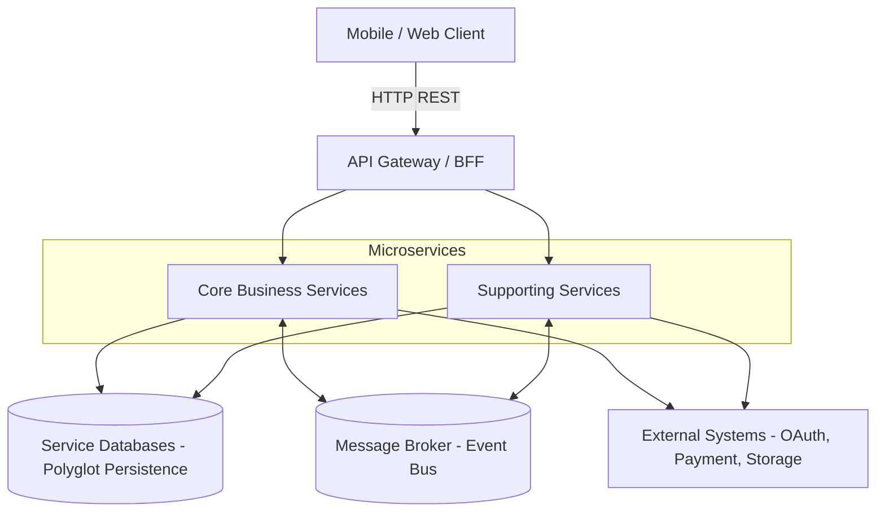

# KIẾN TRÚC TỔNG THỂ HỆ THỐNG (SYSTEM ARCHITECTURE)

**Dự án:** Rent-a-Girlfriend Platform
**Mục tiêu tài liệu:** Cung cấp bức tranh toàn cảnh về mặt kiến trúc phần mềm, nguyên tắc thiết kế và cách các thành phần trong hệ thống tương tác với nhau.

---

## 1. TỔNG QUAN KIẾN TRÚC
Hệ thống được thiết kế theo kiến trúc **Event-Driven Microservices** (Microservices điều hướng bằng sự kiện), kết hợp với nguyên lý **Domain-Driven Design (DDD)**. 

Hệ thống áp dụng triết lý **Polyglot Architecture** (Kiến trúc đa ngôn ngữ/công nghệ): Mỗi Microservice là một thực thể độc lập hoàn toàn, đội ngũ phát triển có toàn quyền quyết định ngôn ngữ lập trình (Node.js, Golang, Java, Python...), framework và hệ quản trị cơ sở dữ liệu (RDBMS, NoSQL) phù hợp nhất với đặc thù nghiệp vụ của service đó.

## 2. SƠ ĐỒ KIẾN TRÚC (HIGH-LEVEL TOPOLOGY)

---

## 3. CÁC NGUYÊN TẮC KIẾN TRÚC CỐT LÕI (CORE PRINCIPLES)

Tất cả các Developer tham gia dự án **BẮT BUỘC** phải tuân thủ các nguyên tắc sau để tránh biến hệ thống thành một "Distributed Monolith" (Kiến trúc nguyên khối phân tán):

### 3.1. Database-per-Service (Một DB cho một Service)
*   Mỗi Microservice sở hữu hoàn toàn cơ sở dữ liệu của riêng nó.
*   **Nghiêm cấm:** Service A kết nối trực tiếp vào Database của Service B để Query dữ liệu.
*   *Giải pháp:* Nếu Service A cần dữ liệu của Service B, nó phải gọi qua API (Sync) hoặc lưu trữ bản sao dữ liệu dạng Read-Model thông qua việc lắng nghe Events (Async).

### 3.2. API Gateway là điểm vào duy nhất (Single Entry Point)
*   Client (Mobile/Web) tuyệt đối không gọi trực tiếp các IP/Port của các Microservices bên trong mạng nội bộ.
*   Mọi request đều phải đi qua API Gateway. Gateway đảm nhiệm các vai trò (Cross-cutting concerns): Xác thực Token (Authentication - sử dụng JWKS từ Identity Service), Rate Limiting, CORS, và Routing định tuyến request đến đúng Service.

### 3.3. Asynchronous First (Ưu tiên Bất đồng bộ)
*   Hệ thống ưu tiên sử dụng Message Broker (Event Bus) để liên lạc giữa các service khi có một trạng thái nghiệp vụ thay đổi (ví dụ: `BookingCompleted`).
*   Việc này giúp các service hoàn toàn lỏng lẻo (Loosely coupled). Nếu Notification Service bị sập, Booking Service vẫn hoạt động bình thường, tin nhắn thông báo sẽ được lưu trong queue và gửi lại khi Notification Service sống lại.

### 3.4. Không phân tán Transaction (No 2-Phase Commit)
*   Vì mỗi service có một DB riêng, hệ thống không thể sử dụng Transaction SQL thông thường cho các nghiệp vụ xuyên service (như vừa trừ tiền, vừa tạo phòng chat).
*   *Giải pháp:* Áp dụng **SAGA Pattern**. Chi tiết triển khai SAGA sẽ được mô tả trong bộ tài liệu `04_Distributed_Transactions`.

---

## 4. DANH SÁCH MICROSERVICES VÀ TRÁCH NHIỆM CHÍNH

Hệ thống được chia thành 7 Microservices, ánh xạ (mapping) trực tiếp từ các Bounded Contexts đã được thiết kế:

| Tên Service | Phân loại | Trách nhiệm chính (Responsibility) |
| :--- | :--- | :--- |
| **Booking Service** | Core | Trái tim nghiệp vụ. Quản lý toàn bộ State Machine của cuộc hẹn (Request, Accept, Cancel, Complete). Đóng vai trò Orchestrator (Điều phối viên) cho SAGA tạo lịch hẹn. |
| **Finance Service** | Core | Lõi tài chính nội bộ. Quản lý ví Kano-Coin, thao tác Freeze tiền cọc, quỹ Escrow, trả hoa hồng và liên kết với cổng VNPay. |
| **Profile Service** | Core | Nơi Companion quản lý danh mục dịch vụ (Scenario), upload hình ảnh, Voice Intro (Media) và cung cấp dữ liệu tìm kiếm cho Client. |
| **Interaction Service** | Supporting | Xử lý môi trường tương tác an toàn sau khi kết nối: Phòng Chat realtime và hệ thống gửi/lưu trữ Đánh giá (Review). |
| **Dispute Service** | Supporting | Xử lý quy trình báo cáo vi phạm, khiếu nại (Dispute). Chứa logic điều phối SAGA hoàn tiền (Refund) hoặc thanh toán (Payout) dựa trên quyết định của Admin. |
| **Identity Service** | Generic | Quản lý định danh User, phân quyền, kiểm soát trạng thái khóa/mở tài khoản và bộ đếm vi phạm cộng đồng. |
| **Notification Service**| Generic | Đóng gói toàn bộ hạ tầng gửi tin (SSE, FCM Push, Email). Hoạt động độc lập bằng cách lắng nghe Event từ toàn hệ thống và phân phối đến User. |

---

## 5. CHIẾN LƯỢC GIAO TIẾP LIÊN DỊCH VỤ (INTER-SERVICE COMMUNICATION)

Mặc dù các service tự do chọn công nghệ, nhưng phương thức giao tiếp (Contract) phải được chuẩn hóa trên toàn hệ thống.

### 5.1. Giao tiếp Đồng bộ nội bộ (Internal Sync API)
*   **Khi nào sử dụng?** Chỉ sử dụng cho tác vụ lấy dữ liệu (GET/Query) đòi hỏi tính nhất quán ngay lập tức, hoặc khi một hành động không thể tiếp tục nếu không có kết quả từ service khác.
*   **Công nghệ đề xuất:** REST (HTTP) hoặc gRPC. Service cung cấp phải quy định rõ cấu trúc dữ liệu trả về.
*   *Ví dụ:* Booking Service gọi API đồng bộ sang Profile Service để lấy "giá tiền" của kịch bản lúc Client bấm nút đặt lịch.

### 5.2. Giao tiếp Bất đồng bộ (Internal Async Pub/Sub)
*   **Khi nào sử dụng?** Sử dụng cho mọi hành vi làm thay đổi trạng thái hệ thống (Commands sinh ra Events) nhằm kích hoạt chuỗi nghiệp vụ ở các service khác (Eventual Consistency).
*   **Hạ tầng:** Message Broker tập trung (Ví dụ: RabbitMQ, Apache Kafka).
*   **Chuẩn tin nhắn:** Mọi Event đẩy lên Broker phải tuân thủ chuẩn **CloudEvents JSON Format** (có chứa `eventId`, `sagaId`, `correlationId`). Chi tiết cấu trúc xem tại thư mục `03_Integration_and_Comms`.

### 5.3. Tích hợp Ngoại vi (External Systems)
*   **Storage (Lưu trữ ảnh, âm thanh):** Áp dụng pattern **Presigned URL**. Hệ thống Backend không xử lý stream file trực tiếp để tránh nghẽn mạng. Profile Service sinh ra link upload tạm thời, Client dùng link đó upload trực tiếp lên Storage Cloud (S3/Cloudinary).
*   **Payment (VNPay):** Finance Service thiết kế API Webhook (IPN) tiếp nhận kết quả thanh toán. Luôn dùng IPN làm *Source of Truth* thay vì tin tưởng kết quả do Client gửi lên.

---
