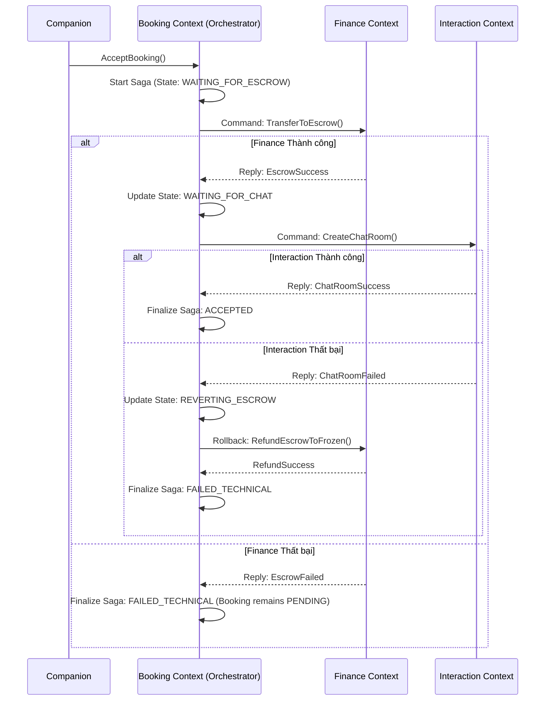
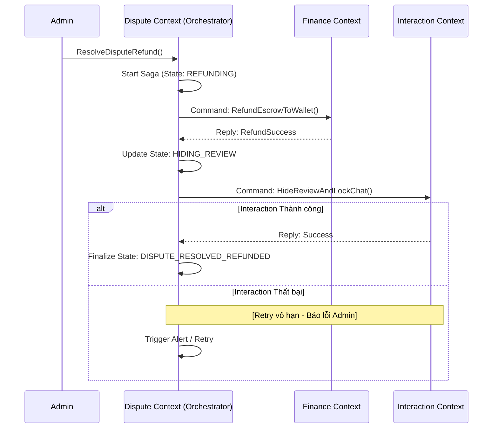

# SAGA WORKFLOWS (QUẢN LÝ GIAO DỊCH PHÂN TÁN)

Hệ thống sử dụng mẫu thiết kế SAGA (cả Orchestration và Choreography) để xử lý các nghiệp vụ xuyên suốt nhiều Bounded Context.

---

## 1. LUỒNG BOOKING CREATION (COMPANION ACCEPT)
*   **Mô hình:** **SAGA Orchestration** (Điều phối trung tâm).
*   **Orchestrator:** `Booking Context`.
*   **Đặc điểm:** Yêu cầu tính nhất quán cao giữa Tiền (`Escrow`) và Quyền lợi (`ChatRoom`). Nếu tiền không vào quỹ đảm bảo thành công, tuyệt đối không được mở chat. Nếu mở Chat thất bại, tiền phải được hoàn trả về Ví.

### Sequence Diagram

---

## 2. LUỒNG DISPUTE RESOLUTION (KHIẾU NẠI)
*   **Mô hình:** **SAGA Orchestration**.
*   **Orchestrator:** `Dispute Context`.
*   **Đặc điểm:** Tùy theo phán quyết của Admin là Refund hay Payout. Đặc thù của Dispute SAGA là **Không Rollback Tiền**. Nếu thao tác ở Chat lỗi (ẩn review, khóa chat), hệ thống dùng Retry vô hạn chứ không trừ tiền ngược lại.

### Luồng Refund (Hoàn tiền cho Client)

### Luồng Payout (Thanh toán cho Companion)
Tương tự Refund, Dispute gọi Finance để `PayoutFromEscrow()`, sau đó gọi Interaction để `LockChatRoom()`. Trạng thái cuối là `DISPUTE_RESOLVED_PAID_OUT`.

---

## 3. LUỒNG HỦY VÀ HOÀN TẤT (CANCELLATION & COMPLETION)
*   **Mô hình:** **SAGA Choreography** (Tự điều phối phân tán).
*   **Đặc điểm:** Các hành động nhánh hoàn toàn độc lập, không cần liên kết hủy bỏ (rollback) nhau. Dựa vào Event phát ra, các service tự chịu trách nhiệm logic nghiệp vụ.

### Luồng Booking Cancel (Bởi Client hoặc Companion)
*   `Booking Context` phát sự kiện `BookingCancelled`.
*   `Finance Context` lắng nghe: tự tính toán thời gian sớm/muộn để quyết định Hoàn 100% cho Client hay Phạt chuyển tiền bồi thường cho Companion.
*   `Interaction Context` lắng nghe: tự thực hiện khóa Chat.
*   *Lỗi của Interaction khóa Chat không làm ảnh hưởng luồng hoàn tiền.*

### Luồng Booking Complete
*   `Booking Context` phát sự kiện `BookingCompleted` sau khi kết thúc thời gian + khoảng chờ (VD: 12h).
*   `Finance Context` lắng nghe: Tiến hành trừ hoa hồng nền tảng và Payout tiền về ví Companion.
*   `Interaction Context` lắng nghe: Tự thực hiện khóa Chat (sau 24h).
