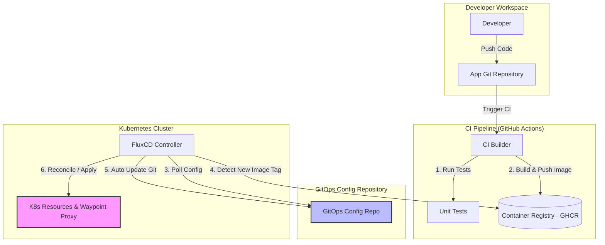

# Kế hoạch Triển khai GitOps với FluxCD cho dịch vụ Notification Service

Tài liệu này phác thảo kế hoạch từng bước để tích hợp mô hình GitOps sử dụng **FluxCD** vào dự án *Rent-a-Girlfriend*, tập trung trước mắt vào dịch vụ `notification-service`.

---

## 1. Mục tiêu & Vấn đề cần Giải quyết

*   **Mục tiêu cụ thể:** Thiết lập luồng phân phối liên tục (Continuous Delivery) tự động, an toàn và có thể khôi phục nhanh chóng cho `notification-service` cũng như các microservices khác trong tương lai.
*   **Giải quyết vấn đề:** 
    *   Tránh việc phân phối thủ công bằng tay (`kubectl apply`) dễ gây sai sót và khó kiểm soát phiên bản.
    *   Đảm bảo trạng thái thực tế chạy trên Kubernetes (Cluster State) luôn khớp 100% với cấu hình được khai báo trong Git (Git State).
    *   Tách biệt hoàn toàn quyền hạn giữa CI (Build/Test) và CD (Deploy) để tăng cường bảo mật (Zero-Trust/Least Privilege).

---

## 2. Thiết kế Hệ thống & Luồng Dữ liệu (Data Flow)

Để giảm thiểu rủi ro lan truyền (blast radius) và tách biệt trách nhiệm, luồng hoạt động được thiết kế như sau:



### Phân tách trách nhiệm (Separation of Concerns):
1.  **Application Repository:** Chỉ chứa mã nguồn của service, Unit Test, Dockerfile và CI workflows.
2.  **GitOps Config Repository (hoặc thư mục GitOps riêng biệt):** Chỉ chứa các file manifest Kubernetes khai báo (Kustomize/Helm).
3.  **FluxCD (chạy trong Cluster):** Tự động kéo cấu hình từ GitOps Config Repo về để áp dụng vào K8s Cluster. Nó hoạt động theo cơ chế Pull-based, bảo mật tuyệt đối vì Cluster không cần mở cổng tiếp nhận kết nối từ bên ngoài.

---

## 3. Trade-offs (Đánh đổi) của Hệ thống

Khi lựa chọn **FluxCD** cho dự án này, chúng ta chấp nhận các đánh đổi sau:

*   **Ưu điểm (Trade-up):**
    *   **Siêu nhẹ & Native K8s:** FluxCD sử dụng các Custom Resource Definitions (CRDs) thuần K8s, không có giao diện Web UI cồng kềnh như ArgoCD, cực kỳ tiết kiệm tài nguyên cho môi trường Dev/Staging nhỏ.
    *   **Bảo mật tối đa (Zero-Trust):** Không có Web UI đồng nghĩa với việc giảm thiểu bề mặt tấn công (attack surface).
    *   **Git làm Nguồn Chân lý duy nhất (Git as Single Source of Truth):** Mọi sự thay đổi trên Cluster đều được lưu vết qua Git history.
*   **Nhược điểm & Rủi ro (Trade-down):**
    *   **Thiếu trực quan:** Không có giao diện GUI trực quan để theo dõi trạng thái như ArgoCD. Mọi thứ phải debug và kiểm tra qua CLI (`flux get ...` hoặc `kubectl get ...`).
    *   **Tốc độ phản hồi (Reconciliation Delay):** FluxCD hoạt động theo chu kỳ quét (ví dụ: quét Git mỗi 1-5 phút). Sự thay đổi trên Git sẽ có một độ trễ nhỏ trước khi được áp dụng xuống Cluster (có thể kích hoạt thủ công qua webhook để giảm độ trễ này).

---

## 4. Kế hoạch triển khai từng bước (Step-by-step)

> [!NOTE]
> Kế hoạch này được chia làm các bước nhỏ, thực hiện độc lập để dễ dàng kiểm soát lỗi.

### Bước 1: Chuẩn bị môi trường Kubernetes Local
*   **Mục tiêu:** Tạo môi trường K8s giả lập dưới local để test cấu hình FluxCD trước khi đưa lên cloud.
*   **Công cụ:** Sử dụng **KinD (Kubernetes in Docker)** hoặc **Minikube**.
*   **Hành động:**
    1. Cài đặt Flux CLI trên máy:
       ```powershell
       # Sử dụng Chocolatey hoặc tải trực tiếp binary
       choco install flux
       ```
    2. Kiểm tra môi trường K8s đã sẵn sàng chưa:
       ```powershell
       flux check --pre
       ```

### Bước 2: Khởi tạo FluxCD (Bootstrap)
*   **Mục tiêu:** Cài đặt các Controller của FluxCD vào Kubernetes Cluster và liên kết nó với Git Repository của bạn.
*   **Hành động:** Chạy lệnh bootstrap (Cần chuẩn bị sẵn GitHub Personal Access Token - PAT):
    ```powershell
    $env:GITHUB_TOKEN="ghp_your_personal_access_token_here"
    
    flux bootstrap github `
      --owner=your-github-username `
      --repository=rent-a-girlfriend `
      --branch=main `
      --path=infra/k8s/flux-system `
      --personal
    ```
    *Lưu ý: FluxCD sẽ tự động tạo thư mục `infra/k8s/flux-system` trên Git repo của bạn và commit các cấu hình của nó lên đó.*

### Bước 3: Cấu trúc thư mục GitOps
Chúng ta sẽ thiết kế cấu trúc thư mục dạng **Kustomize** để dễ tái sử dụng cấu hình giữa các môi trường (dev, staging, prod) mà không bị lặp lại code (DRY - Don't Repeat Yourself).

Tạo cấu trúc thư mục sau trong repo:
```text
infra/
└── k8s/
    ├── apps/
    │   └── notification-service/
    │       ├── base/
    │       │   ├── deployment.yaml
    │       │   ├── service.yaml
    │       │   └── kustomization.yaml
    │       └── overlays/
    │           ├── dev/
    │           │   ├── patches.yaml
    │           │   └── kustomization.yaml
    │           └── prod/
    └── flux-system/ (do Flux tự động sinh ra khi bootstrap)
```

### Bước 4: Khai báo Ứng dụng với Flux (Custom Resources)
Tạo file khai báo để Flux biết nơi lấy cấu hình của `notification-service` và apply vào cluster.

1.  **Khai báo Nguồn Git (GitRepository):**
    ```yaml
    # infra/k8s/apps/notification-service/gitrepo.yaml
    apiVersion: source.toolkit.fluxcd.io/v1
    kind: GitRepository
    metadata:
      name: notification-service-source
      namespace: flux-system
    spec:
      interval: 1m0s
      url: https://github.com/your-github-username/rent-a-girlfriend.git
      ref:
        branch: main
    ```

2.  **Khai báo Đồng bộ (Kustomization):**
    ```yaml
    # infra/k8s/apps/notification-service/kustomization.yaml
    apiVersion: kustomize.toolkit.fluxcd.io/v1
    kind: Kustomization
    metadata:
      name: notification-service-deploy
      namespace: flux-system
    spec:
      interval: 2m0s
      path: ./infra/k8s/apps/notification-service/overlays/dev
      prune: true # Tự động xóa các tài nguyên K8s nếu chúng bị xóa khỏi Git
      sourceRef:
        kind: GitRepository
        name: notification-service-source
      targetNamespace: rent-a-girlfriend
    ```

### Bước 5: Cấu hình tự động cập nhật Image (Image Update Automation)
Để quy trình được khép kín 100% tự động khi có code mới:
1.  **ImageRepository:** Flux quét Docker Registry để phát hiện các tag mới được push lên từ CI.
2.  **ImagePolicy:** Định nghĩa luật để chọn tag (ví dụ: chỉ chọn các tag dạng semver `1.x.x` hoặc tag có chứa commit SHA mới nhất).
3.  **ImageUpdateAutomation:** Flux tự động tạo commit sửa tag image trong Git repo của bạn khi có image mới xuất hiện.

---

## 5. Quy trình Kiểm thử & Xác minh (Verification Plan)

Khi bạn tiến hành chạy thực tế, hãy làm theo quy trình kiểm thử này:

1.  **Kiểm tra Flux đồng bộ thành công:**
    ```powershell
    flux get kustomizations --watch
    ```
    Trạng thái phải báo `Ready: True` và hiển thị mã commit SHA mới nhất.
2.  **Kiểm tra Pod chạy đúng:**
    ```powershell
    kubectl get pods -n rent-a-girlfriend
    ```
3.  **Thử nghiệm phục hồi (Self-healing test):**
    *   Hãy thử dùng lệnh xóa thủ công Deployment: `kubectl delete deployment notification-service -n rent-a-girlfriend`.
    *   Đợi 1-2 phút, FluxCD phải tự động phát hiện ra sự lệch lạc cấu hình (Drift) và tự tạo lại Deployment đó về đúng trạng thái khai báo trên Git. Nếu Deployment tự động xuất hiện lại -> **Thành công!**
