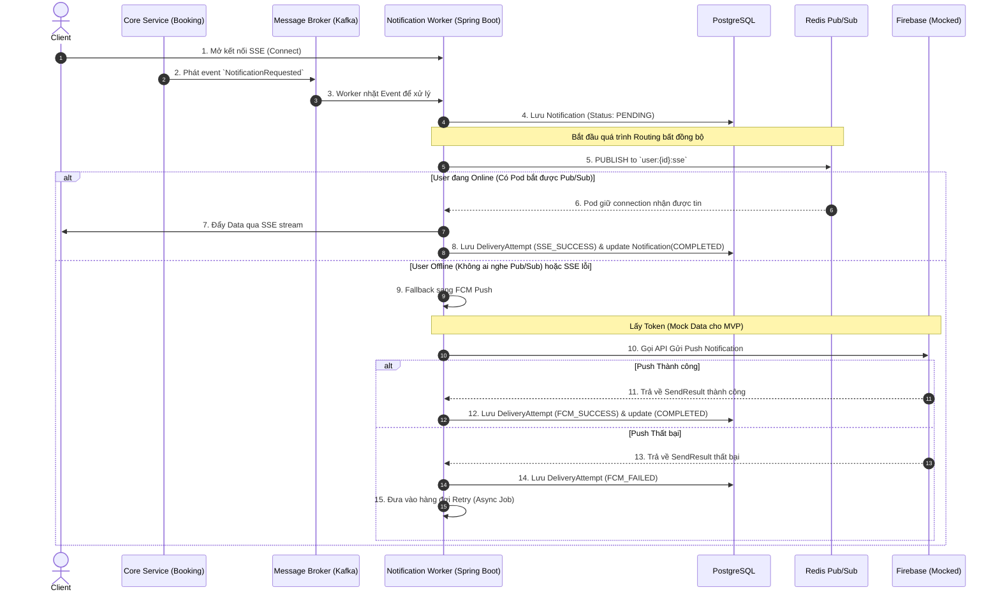

# 🏗️ KIẾN TRÚC HỆ THỐNG VÀ LUỒNG DỮ LIỆU (SYSTEM ARCHITECTURE & FLOW)

Tài liệu này cung cấp bức tranh toàn cảnh về mặt kỹ thuật của Notification Service. Thiết kế ưu tiên sự đồng thời (concurrency), khả năng mở rộng ngang (horizontal scaling) và giải quyết bài toán giao tiếp thời gian thực trong môi trường phân tán.

> [!TIP]
> Hệ thống được tối ưu hóa cho **Java 21** và **Spring Boot 3.5.0**. Tận dụng sức mạnh của **Spring MVC (SseEmitter)** kết hợp với **Virtual Threads** để xử lý hàng chục ngàn kết nối SSE đồng thời và gửi tin bất đồng bộ hiệu năng cao mà không làm nghẽn tài nguyên hệ thống.

---

## 1. THÀNH PHẦN KỸ THUẬT (TECH STACK COMPONENTS)

Hệ thống xoay quanh các thành phần sau:
1. **Event Bus (Kafka / RabbitMQ)**: Trạm thu phát tín hiệu. Nhận `NotificationRequested` từ các Core Services.
2. **PostgreSQL**: Nơi lưu trữ trạng thái (Persistence). Dùng **Spring Data JPA (Hibernate)** để quản lý `Notification` và `DeliveryAttempt`.
3. **Redis Pub/Sub**: Trái tim của hệ thống SSE phân tán. Dùng để "bắn tin" giữa các Pods (Instances) của Notification Service.
4. **FCM (Firebase Cloud Messaging)**: Provider bên thứ 3 để gửi Push Notification.
5. **SSE (Server-Sent Events)**: Giao thức một chiều (Server -> Client) dùng để đẩy Realtime lên Web/App với độ trễ siêu thấp thông qua `SseEmitter` của Spring.

---

## 2. BÀI TOÁN PHÂN TÁN (DISTRIBUTED SSE PROBLEM)

**Vấn đề:** 
Hệ thống có thể chạy 3 instances của Notification Service (Pod A, Pod B, Pod C) đằng sau 1 Load Balancer.
- Client X đang kết nối SSE vào **Pod A**.
- Event `NotificationRequested` (dành cho Client X) lại được Message Broker phân phối ngẫu nhiên cho Worker ở **Pod C** xử lý.
- Làm sao Pod C đẩy được tin nhắn xuống Client X khi nó không giữ connection của X?

**Giải pháp: Sử dụng Redis Pub/Sub**
- Khi Pod C muốn gửi SSE cho Client X, nó không thể gửi trực tiếp. Thay vào đó, Pod C sẽ **Publish** một message vào kênh (Topic) trên Redis, ví dụ: `channel:user_x:sse`.
- Tất cả các Pod (A, B, C) đều **Subscribe** vào cụm kênh của Redis.
- Pod A nghe thấy có tin nhắn trên kênh `channel:user_x:sse`. Nó tự nhận thấy: *"À, mình đang giữ connection của User X"*, và thực hiện đẩy message xuống thiết bị qua kênh SSE của mình. Pod B và C phớt lờ message đó.

---

## 3. SƠ ĐỒ LUỒNG DỮ LIỆU CHÍNH (CORE DATA FLOW)

Dưới đây là luồng xử lý từ lúc có Event đến khi tin nhắn tới được Client. Theo cấu hình MVP, hệ thống ưu tiên luồng SSE và sẽ **Mock data FCM Token** để tối ưu tốc độ phát triển giai đoạn đầu.

---

## 4. CHIẾN LƯỢC XỬ LÝ ĐỒNG THỜI (CONCURRENCY STRATEGY)

Trong môi trường Java & Spring Boot, chúng ta áp dụng các Pattern sau:

### 4.1. SSE Connection Pool (Local Memory)
Mỗi Instance sẽ duy trì một `SseConnectionRegistry` sử dụng cấu trúc dữ liệu thread-safe `ConcurrentHashMap`:
- **Cấu trúc**: `Map<UUID, List<SseEmitter>>`
  - Key: `UserId` (UUID)
  - Value: Danh sách các kết nối `SseEmitter` đang mở của người dùng đó (để hỗ trợ đa thiết bị).
- **Quản lý kết nối**: Bắt buộc đăng ký các sự kiện callback `onCompletion()`, `onTimeout()`, và `onError()` trên từng `SseEmitter` để dọn dẹp các kết nối chết khỏi Registry ngay lập tức, tránh rò rỉ bộ nhớ (Memory Leak).

### 4.2. Xử lý Bất đồng bộ với Java 21 Virtual Threads (Outbound Requests)
Để tránh việc gọi các API bên thứ 3 (Firebase, SMTP) chặn luồng xử lý chính (Sync Block) gây nghẽn hệ thống, chúng ta cấu hình xử lý bất đồng bộ (`@Async`):
- **Cơ chế**: Sử dụng Spring `@EnableAsync` kết hợp với Java 21 Virtual Threads.
- **Cấu hình**: Do hệ thống bật `spring.threads.virtual.enabled: true` trong `application.yml`, Spring Boot 3.5.0 sẽ tự động phát hiện cấu hình này và thay thế Task Executor mặc định bằng `SimpleAsyncTaskExecutor` chạy trên Virtual Threads.
- **Lợi ích**: Không giới hạn kích thước Thread Pool truyền thống, các Virtual Threads được tạo lập cực nhanh với chi phí tài nguyên cực thấp (rẻ hơn Platform Threads hàng ngàn lần), tối ưu hóa triệt để cho các tác vụ I/O blocking.

### 4.3. Cơ chế Retry bất đồng bộ (Backoff không Block)
Nếu gửi FCM/Email thất bại với lỗi có thể thử lại (`recoverable = true`):
- Lần thử 1: Chờ 2 giây.
- Lần thử 2: Chờ 4 giây.
- Lần thử 3: Chờ 8 giây.
- Nếu thất bại quá 3 lần: Đóng trạng thái `FAILED` theo đúng Invariant `[INV-N01]`.
- **Cơ chế không block**: Tuyệt đối **CẤM** sử dụng `Thread.sleep()` trong Worker vì sẽ gây đóng băng và cạn kiệt Thread Pool. Thay vào đó:
  - Sử dụng **`ScheduledExecutorService`** của Java (được cấu hình chạy trên Virtual Threads) để lên lịch chạy lại (Delayed Task) bất đồng bộ.
  - Hoặc gửi một Delayed Message ngược lại Broker (Kafka) để xử lý retry sau khoảng thời gian backoff.
