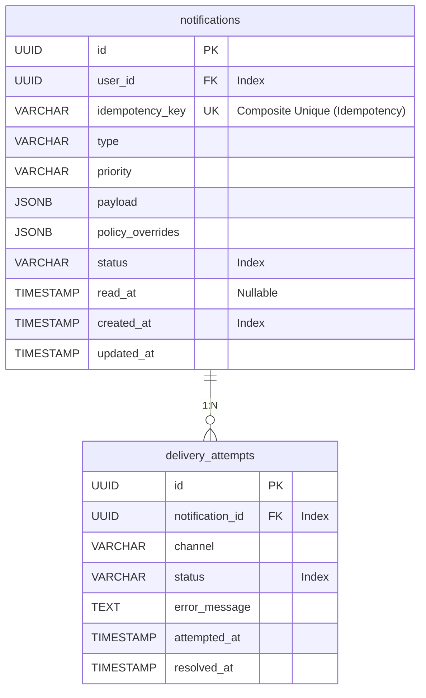

# 🗄️ DATABASE SCHEMA (DATA MODEL)

Tài liệu này đặc tả cấu trúc cơ sở dữ liệu (PostgreSQL) cho Notification Service. Thiết kế hướng tới sự cân bằng giữa **MVP-friendly** (Dễ code, dễ triển khai) và **Production-minded** (Khả năng đánh index, tra cứu lỗi, idempontency, và mở rộng sau này).

---

## 1. TẠI SAO LẠI TÁCH BẢNG? (RATIONALE)

Như đã đề cập ở [ADR-0002](./adr/0002-database-choice-postgresql.md) và [Domain Model](./notification-domain-model.md), chúng ta quyết định tách Notification ra thành 2 bảng có quan hệ 1-N. 

Từ góc nhìn Database, việc này mang lại các lợi thế sống còn:
1. **Tránh Row Bloating**: `delivery_attempts` chứa các thông báo lỗi (có thể là một chuỗi stack trace rất dài từ Firebase). Nếu gộp chung vào bảng `notifications` dưới dạng `JSONB Array`, kích thước của một row `notifications` sẽ phình to bất thường, làm chậm toàn bộ các truy vấn quét bảng (như lúc get Inbox cho User).
2. **Append-Only Log**: Khi hệ thống retry, worker chỉ cần **INSERT** thêm 1 dòng vào bảng `delivery_attempts` thay vì phải khóa (Row-level lock) và **UPDATE** cột JSONB của bảng `notifications`. Điều này giảm thiểu contention (cạnh tranh) khi chạy với hàng chục Goroutine đồng thời.
3. **Index linh hoạt**: Dễ dàng đánh index cho bảng `delivery_attempts` để truy vấn: "Có bao nhiêu lỗi Timeout do Firebase hôm nay?".

---

## 2. DATABASE SCHEMA (ER DIAGRAM)

---

## 3. ĐỊNH NGHĨA BẢNG VÀ CỘT (TABLES & COLUMNS)

### 3.1. Bảng `notifications`
Đóng vai trò là Master Record. Đại diện cho một luồng thông tin (Notification Center / Inbox) của một User.

| Tên cột | Kiểu dữ liệu | Mô tả & Ràng buộc |
| :--- | :--- | :--- |
| `id` | `UUID` | Khóa chính (Primary Key). |
| `user_id` | `UUID` | ID của người nhận. |
| `idempotency_key` | `VARCHAR(128)` | Cột trong khóa composite unique. Đảm bảo **Idempotency** theo từng User nhận tin. |
| `type` | `VARCHAR(50)` | `TRANSACTIONAL`, `INTERACTION`, `PROMOTIONAL`. |
| `priority` | `VARCHAR(20)` | `HIGH`, `MEDIUM`, `LOW`. |
| `payload` | `JSONB` | Chứa `{ "title": "...", "body": "...", "actionUrl": "..." }`. |
| `policy_overrides`| `JSONB` | Chứa `{ "requirePush": true }`. Có thể Null. |
| `status` | `VARCHAR(20)` | `PENDING`, `PROCESSING`, `COMPLETED`, `FAILED`. |
| `read_at` | `TIMESTAMP` | Nullable. Đánh dấu thời điểm User click vào xem. Hỗ trợ API Đã đọc. |
| `created_at` | `TIMESTAMP` | Mặc định `NOW()`. |
| `updated_at` | `TIMESTAMP` | Cập nhật mỗi khi `status` đổi. |

### 3.2. Bảng `delivery_attempts`
Lưu vết từng lần gọi API nội bộ hoặc bên thứ 3 (Firebase, Email).

| Tên cột | Kiểu dữ liệu | Mô tả & Ràng buộc |
| :--- | :--- | :--- |
| `id` | `UUID` | Khóa chính (Primary Key). |
| `notification_id` | `UUID` | Khóa ngoại (Foreign Key) chỉ tới `notifications(id)`. Xóa cascade. |
| `channel` | `VARCHAR(20)` | `SSE`, `FCM`, `EMAIL`. |
| `status` | `VARCHAR(20)` | `PENDING`, `SUCCESS`, `FAILED_RECOVERABLE`, `FAILED_UNRECOVERABLE`. |
| `message_id` | `VARCHAR(128)` | Nullable. ID tin nhắn từ Provider (Email message ID hoặc FCM message ID). |
| `error_code` | `VARCHAR(50)` | Nullable. Mã lỗi kỹ thuật thu được từ bên thứ 3 (VD: `SMTP_TIMEOUT`, `FCM_TOKEN_INVALID`). |
| `error_message` | `TEXT` | Nullable. Ghi lại lý do lỗi chi tiết (VD: `socket: connection reset by peer`). |
| `attempted_at` | `TIMESTAMP` | Thời điểm Worker bốc Job lên gửi. Mặc định `NOW()`. |
| `resolved_at` | `TIMESTAMP` | Nullable. Thời điểm nhận được kết quả từ Provider. |

---

## 4. CHIẾN LƯỢC ĐÁNH INDEX (INDEXING STRATEGY)

Việc đánh Index quyết định trực tiếp hiệu năng hệ thống ở mức Production.

### Indexes trên bảng `notifications`:
1. `UNIQUE INDEX uk_notifications_idempotency_user (idempotency_key, user_id)`: 
   - **Tác dụng**: Cực kỳ quan trọng. Ngăn chặn gửi trùng lặp thông báo cho cùng một User từ cùng một khóa idempotency gốc, đồng thời cho phép phân phối đa đối tượng (multi-recipient).
2. `INDEX idx_notifications_inbox (user_id, created_at DESC)`:
   - **Tác dụng**: Phục vụ API lấy danh sách Inbox của Client (App/Web). Client thường query: `WHERE user_id = ? ORDER BY created_at DESC LIMIT 20`. Index kép này giúp câu query tốn chưa tới 1ms.
3. `INDEX idx_notifications_stuck (status, created_at)`:
   - **Tác dụng**: Phục vụ Background Worker / Cronjob quét các tin nhắn bị kẹt: `WHERE status = 'PENDING' AND created_at < NOW() - INTERVAL '5 MINUTE'`. 

### Indexes trên bảng `delivery_attempts`:
1. `INDEX idx_delivery_attempts_notif_id (notification_id)`:
   - **Tác dụng**: Giúp câu lệnh `JOIN` giữa `notifications` và `delivery_attempts` chạy mượt mà.
2. `INDEX idx_delivery_attempts_status_channel (status, channel)` (Tùy chọn):
   - **Tác dụng**: Phục vụ việc Query thống kê nội bộ (VD: Tính tỷ lệ gửi lỗi của kênh FCM trong ngày). 

> [!IMPORTANT]
> **Hướng mở rộng (Scalability Note)**: Bảng `delivery_attempts` sẽ phình to rất nhanh với tốc độ cấp số nhân so với bảng `notifications`. Ở giai đoạn MVP thì cấu trúc trên là quá đủ. Ở giai đoạn Scale-up, cần cấu hình **Table Partitioning** theo Tháng (`PARTITION BY RANGE (attempted_at)`) trên PostgreSQL để dễ dàng xóa các log cũ.
