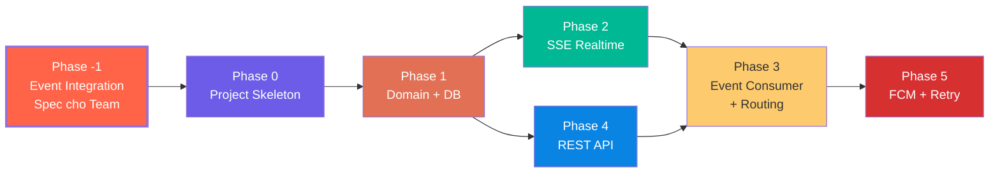

# 📅 TIMELINE PHÁT TRIỂN NOTIFICATION SERVICE

## Tổng quan

**Notification Service** = **Delivery Hub** — làm chủ cuộc chơi về thông báo. Define mình cần gì, các team follow.

**Tech Stack**: Java / Spring Boot

---

## Chiến lược chia Phase



---

## Phase -1: Event Integration Specification (Viết tài liệu cho Team)

**Mục tiêu**: Phân tích toàn bộ nghiệp vụ, quyết định strategy cho từng event, viết thành tài liệu chính thức để team follow.

### Deliverable chính: `docs/event-integration-guide.md`

Tài liệu **đối ngoại** — source of truth cho team. Nội dung:

#### 1. Bảng Event Subscription

| Strategy | Ý nghĩa | Source Service cần làm gì |
|:---|:---|:---|
| 🟢 **Smart Consumer** | Notification tự lắng nghe, tự dịch thành thông báo | Publish event đúng payload |
| 🟡 **Passive Subscriber** | Service gọi qua `notification.requested.v1` | Tự format nội dung |
| ⚪ **Ignore (hiện tại)** | Không lắng nghe ở thời điểm này | — |

> [!TIP]
> **Khả năng mở rộng cho Ignore events**: Bất kỳ event nào hiện đang Ignore đều có thể được "bật" thành Smart Consumer trong tương lai chỉ bằng cách thêm config vào `templates.yaml` + subscribe topic mới. Ngoài ra, kênh **Passive Subscriber** (`notification.requested.v1`) luôn mở — bất kỳ service nào cũng có thể gửi notification bất cứ lúc nào mà không cần Notification Service biết trước nghiệp vụ.

#### 2. Payload Requirements cho từng event

Với mỗi Smart Consumer event, define rõ:
- **Recipient Field**: Field nào chứa userId người nhận
- **Required Fields**: Payload BẮT BUỘC phải chứa
- **Template Variables**: Fields dùng interpolate nội dung
- **Notification Type / Priority / Channels**

#### 3. Passive Channel Contract (`notification.requested.v1`)

#### 4. Integration Notes cho Team
- Events phải **self-contained** — Notification KHÔNG gọi ngược source service
- Duplicate events bị reject (idempotency qua `eventId`)
- Notification KHÔNG quyết định gửi hay không — chỉ thực thi theo policy

---

### Phạm vi phân tích events

#### Booking Context

| Event | Strategy | Recipient | Mô tả |
|:---|:---|:---|:---|
| `booking.requested.v1` | 🟢 Smart | Companion | Yêu cầu đặt lịch mới |
| `booking.accepted.v1` | 🟢 Smart | Client | Companion chấp nhận |
| `booking.rejected.v1` | 🟢 Smart | Client | Companion từ chối |
| `booking.cancelled.v1` | 🟢 Smart | Đối phương | Hủy lịch |

#### Finance Context

| Event | Strategy | Recipient | Mô tả |
|:---|:---|:---|:---|
| `finance.topup.completed.v1` | 🟢 Smart | Client | Nạp Kano-Coin thành công |
| `finance.payout.processed.v1` | 🟢 Smart | Companion | Nhận thanh toán |

#### Interaction Context

| Event | Strategy | Recipient | Mô tả |
|:---|:---|:---|:---|
| `chat.message.sent.v1` | 🟢 Smart | RecipientId | Tin nhắn mới |
| `interaction.review.submitted.v1` | 🟢 Smart | Companion | Nhận đánh giá mới |

#### Profile Context

| Event | Strategy | Recipient | Mô tả |
|:---|:---|:---|:---|
| `profile.companion.approved.v1` | 🟢 Smart | UserId | Hồ sơ Companion được duyệt |
| `profile.companion.rejected.v1` | 🟢 Smart | UserId | Hồ sơ Companion bị từ chối |
| `profile.scenario.rejected.v1` | 🟢 Smart | CompanionId | Scenario bị từ chối (vi phạm nội dung) |
| `profile.voice_intro.rejected.v1` | 🟢 Smart | CompanionId | Voice intro bị từ chối |
| `profile.album_image.rejected.v1` | 🟢 Smart | CompanionId | Ảnh album bị từ chối |

#### Identity Context

| Event | Strategy | Recipient | Mô tả |
|:---|:---|:---|:---|
| `identity.upgrade.approved.v1` | 🟢 Smart | UserId | Yêu cầu nâng cấp Companion được duyệt |
| `identity.upgrade.rejected.v1` | 🟢 Smart | UserId | Yêu cầu nâng cấp bị từ chối |
| `identity.account.locked.v1` | 🟢 Smart | UserId | Tài khoản bị khóa do vi phạm |

#### Dispute Context

| Event | Strategy | Recipient | Mô tả |
|:---|:---|:---|:---|
| `dispute.report.created.v1` | 🟢 Smart | Accused | Bạn bị báo cáo |
| `dispute.resolved.v1` | 🟢 Smart | Cả 2 bên | Kết quả khiếu nại |

#### Ignore (hiện tại)

| Event | Lý do | Mở rộng sau |
|:---|:---|:---|
| `finance.coin.frozen/escrowed.v1` | SAGA nội bộ | Passive channel nếu cần |
| `chat.room.created.v1` | User đã biết từ booking.accepted | Passive channel nếu cần |
| `profile.created/updated.v1` | Thao tác của chính user | Passive channel nếu cần |
| `scenario.created/updated/deleted.v1` | Thao tác nội bộ companion | Passive channel nếu cần |
| `voice/album.uploaded.v1` | Chỉ upload, chưa có kết quả | Passive channel nếu cần |
| `identity.violation.recorded.v1` | Nội bộ hệ thống, account.locked đã cover | Smart Consumer nếu cần cảnh báo |

---

### Đồng bộ docs nội bộ

Sau khi `event-integration-guide.md` xong, cập nhật:
- `domain-event-mapping.md` — thêm events mới (Profile rejections, Identity upgrade, Dispute, Review)
- `templates.yaml` — thêm templates vi/en cho events mới
- `README.md` — link tài liệu mới

### Tiêu chí Done
- [ ] `docs/event-integration-guide.md` hoàn chỉnh
- [ ] Toàn bộ events phân loại Smart/Passive/Ignore
- [ ] Mỗi Smart Consumer event có payload requirements
- [ ] `domain-event-mapping.md` + `templates.yaml` sync
- [ ] Team đọc xong biết chính xác cần publish gì

---

## Phase 0: Project Skeleton (Java / Spring Boot)

**Mục tiêu**: Dựng bộ khung Java theo Hexagonal Architecture.

### Deliverables

| Task | Mô tả |
|:---|:---|
| Init Spring Boot project | Spring Initializr hoặc manual |
| Hexagonal Folder Structure | `domain/`, `application/`, `interfaces/`, `infrastructure/` |
| Config Management | `application.yml` — DB, Redis, Broker |
| Logging | SLF4J + Logback, structured JSON |
| Error Framework | Domain errors → HTTP mapping |
| Build tool | Maven/Gradle, profiles (dev/prod) |

### Folder Structure

```
notification-service/
├── src/main/java/com/rentagf/notification/
│   ├── domain/              # Pure business logic
│   │   ├── model/           # Notification, DeliveryAttempt
│   │   ├── event/           # Domain Events
│   │   └── port/            # Repository interfaces
│   ├── application/         # Use Cases
│   │   ├── usecase/         # SendNotification, MarkRead...
│   │   └── port/            # Driven ports (SSE, FCM, Email)
│   ├── interfaces/          # Driving Adapters (Input)
│   │   ├── rest/            # REST Controllers
│   │   ├── sse/             # SSE Controller
│   │   └── consumer/        # Message Broker Listener
│   └── infrastructure/      # Driven Adapters (Output)
│       ├── persistence/     # JPA/JDBC Repository impl
│       ├── redis/           # Pub/Sub adapter
│       ├── fcm/             # Firebase adapter (Mock)
│       └── smtp/            # Email adapter (Mock)
├── src/main/resources/
│   ├── application.yml
│   ├── db/migration/        # Flyway migrations
│   └── templates.yaml
├── src/test/
│   ├── unit/
│   ├── integration/
│   └── README.md
└── docs/
```

### Tiêu chí Done
- [ ] Build thành công (`mvn clean compile` hoặc `gradle build`)
- [ ] Config loader hoạt động
- [ ] Logger structured JSON output
- [ ] Health check endpoint `/actuator/health`

---

## Phase 1: Domain Layer + Database

**Mục tiêu**: Business logic thuần túy + DB schema. **Phase quan trọng nhất.**

### Deliverables
- Enums: `NotificationType`, `Priority`, `Status`, `Channel`
- `Notification` Aggregate Root + behaviors (`createAttempt`, `markAttemptSuccess`, `markAttemptFailed`, `hasExceededRetryLimit`)
- `DeliveryAttempt` Entity
- 3 Invariants: `[INV-N01]` Retry ≤ 3, `[INV-N02]` No attempt after COMPLETED, `[INV-N03]` Idempotency
- State Machine + Failure Classification
- Domain Errors
- Repository Port (interface)
- Flyway Migration: 2 bảng + 5 indexes
- JPA/JDBC Repository Adapter

### Unit Tests (Trọng tâm — 100% coverage cho Invariants + State Machine)

### Tiêu chí Done
- [ ] 3 Invariants bảo vệ bằng test (mỗi INV ≥ 3 cases)
- [ ] State Machine transitions khớp `state-machine.md`
- [ ] DB migration chạy thành công
- [ ] Repository CRUD pass

---

## Phase 2: SSE Realtime Delivery

**Mục tiêu**: Client mở SSE → nhận thông báo realtime. Redis Pub/Sub cho phân tán.

### Deliverables
- SSE Controller (`GET /v1/notifications/stream`) — Spring WebFlux SseEmitter
- Connection Manager (ConcurrentHashMap, thread-safe)
- Heartbeat (ping mỗi 15s)
- Auth Header Extraction (`x-user-id`)
- Redis Pub/Sub Adapter (Spring Data Redis)
- Graceful Disconnect

### Tiêu chí Done
- [ ] Client connect SSE, nhận heartbeat
- [ ] Redis Publish → Client nhận qua SSE
- [ ] Disconnect detection hoạt động
- [ ] Multi-connection per user

---

## Phase 3: Event Consumer + Routing Engine

**Mục tiêu**: Lắng nghe events từ Broker → dịch → routing → deliver.

**Dependencies**: Phase 1 + Phase 2

### Deliverables
- Broker Consumer (Spring AMQP / Spring Kafka)
- CloudEvents Parser
- Idempotency Guard
- Event Translator Layer (dựa trên `event-integration-guide.md`)
- Template Engine (load `templates.yaml`, interpolate, i18n)
- Routing Engine (Email → SSE First → FCM Fallback)
- Send Notification Use Case

### Tiêu chí Done
- [ ] Event → User nhận SSE notification đúng template
- [ ] Duplicate rejected
- [ ] Template interpolation đúng vi/en
- [ ] Routing đúng Decision Tree

---

## Phase 4: REST API (Song song Phase 2)

**Dependencies**: Phase 1

### Deliverables
- `GET /v1/notifications` (Cursor-based pagination)
- `PATCH /v1/notifications/{id}/read`
- `PATCH /v1/notifications/read-all`
- Cursor Encoder/Decoder, Unread Count, Error Responses, Auth Middleware

### Tiêu chí Done
- [ ] Cursor pagination chính xác
- [ ] `unread_count` đúng
- [ ] Response format khớp `api-contract.md`

---

## Phase 5: FCM Push + Retry

**Dependencies**: Phase 3

### Deliverables
- FCM Adapter (Mock)
- Thread Pool (ExecutorService / Virtual Threads)
- Exponential Backoff (2s → 4s → 8s)
- Failure Classification (Recoverable → Retry, Unrecoverable → Fail ngay)
- Email Adapter (Mock)

### Tiêu chí Done
- [ ] SSE fail → FCM fallback
- [ ] Retry 3 lần → FAILED
- [ ] Unrecoverable → skip retry
- [ ] Thread pool graceful shutdown

---

## Tổng kết Timeline

| Phase | Thời gian | Tích lũy |
|:---|:---|:---|
| Phase -1: Event Integration Spec | 3 ngày | 3 ngày |
| Phase 0: Skeleton | 2 ngày | 5 ngày |
| Phase 1: Domain + DB | 5 ngày | 10 ngày |
| Phase 2: SSE (song song P4) | 5 ngày | 15 ngày |
| Phase 4: REST API | 3 ngày | (song song) |
| Phase 3: Consumer + Routing | 5 ngày | 20 ngày |
| Phase 5: FCM + Retry | 5 ngày | 25 ngày |
| **Tổng** | | **~25 ngày (~5 tuần)** |

---

## Open Questions

> [!WARNING]
> 1. **Message Broker**: RabbitMQ hay Kafka?
> 2. **Java version**: Java 17 hay 21 (Virtual Threads)?
> 3. **Persistence**: Spring Data JPA hay JDBC Template?
> 4. **FCM Token**: MVP mock hay cần gRPC tới Profile Service?
> 5. **User Language**: Default `vi` hay query Profile?
> 6. **Dispute events**: Thêm vào MVP hay defer?
> 7. **Build tool**: Maven hay Gradle?
