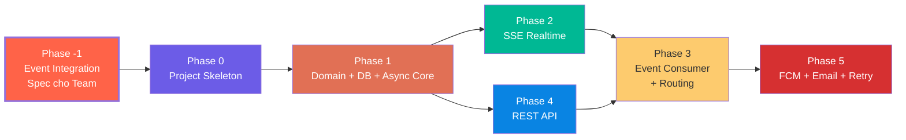

# 📅 TIMELINE PHÁT TRIỂN NOTIFICATION SERVICE

## Tổng quan

**Notification Service** = **Delivery Hub** — làm chủ cuộc chơi về thông báo. Định nghĩa những gì service cần và các service khác sẽ follow.

**Tech Stack**: Java 21 / Spring Boot 3.5.0 / Gradle / Spring Data JPA / Spring Kafka / PostgreSQL / Redis

---

## Chiến lược chia Phase

---

## Phase -1: Event Integration Specification (Viết tài liệu cho Team)

**Mục tiêu**: Phân tích toàn bộ nghiệp vụ, quyết định strategy cho từng event, viết thành tài liệu chính thức để team follow.

### Deliverable chính: `docs/event-integration-guide.md`

Tài liệu **đối ngoại** — source of truth cho team. Nội dung:

#### 1. Bảng Event Subscription

| Strategy                 | Ý nghĩa                                            | Source Service cần làm gì  |
| :----------------------- | :------------------------------------------------- | :------------------------- |
| 🟢 **Smart Consumer**     | Notification tự lắng nghe, tự dịch thành thông báo | Publish event đúng payload |
| 🟡 **Passive Subscriber** | Service gọi qua `notification.requested.v1`        | Tự format nội dung         |
| ⚪ **Ignore (hiện tại)**  | Không lắng nghe ở thời điểm này                    | —                          |

> [!TIP]
> **Khả năng mở rộng cho Ignore events**: Bất kỳ event nào hiện đang Ignore đều có thể được "bật" thành Smart Consumer trong tương lai chỉ bằng cách thêm config vào `templates.yaml` + subscribe topic mới. Ngoài ra, kênh **Passive Subscriber** (`notification.requested.v1`) luôn mở — bất kỳ service nào cũng có thể gửi notification bất cứ lúc nào mà không cần Notification Service biết trước nghiệp vụ.

#### 2. Payload Requirements cho từng event

Với mỗi Smart Consumer event, define rõ:
- **Recipient Field**: Field nào chứa userId người nhận
- **Required Fields**: Payload BẮT BUỘC phải chứa
- **Template Variables**: Fields dùng interpolate nội dung
- **Notification Type / Priority / Channels**

#### 3. Passive Channel Contract (`notification.requested.v1`)

#### 4. Quy tắc Tích hợp (Integration Notes)
- Các sự kiện phải **self-contained** (Tự đóng gói thông tin) — Notification KHÔNG gọi ngược lại source service để lấy thêm dữ liệu.
- Trùng lặp event sẽ bị loại bỏ (Idempotency Guard qua `idempotency_key`).

---

## Phase 0: Project Skeleton (Java 21 / Spring Boot 3.5.0) - [ĐÃ HOÀN THÀNH]

**Mục tiêu**: Dựng bộ khung Java theo Hexagonal Architecture và tích hợp các thư viện nền tảng.

### Deliverables

| Nhiệm vụ                   | Trạng thái   | Chi tiết                                                                  |
| :------------------------- | :----------- | :------------------------------------------------------------------------ |
| Khởi tạo Spring Boot 3.5.0 | 🟢 Hoàn thành | Java 21, Gradle làm công cụ build chính.                                  |
| Cấu trúc Thư mục Lục giác  | 🟢 Hoàn thành | Chia rõ rệt: `domain/`, `application/`, `interfaces/`, `infrastructure/`. |
| Cấu hình Hệ thống          | 🟢 Hoàn thành | Quản lý qua `application.yml` (DB PostgreSQL, Redis, Kafka).              |
| Actuator & Health Check    | 🟢 Hoàn thành | Kích hoạt endpoint `/actuator/health`.                                    |

---

## Phase 1: Domain Layer + Database + Async Core - [PHASE HIỆN TẠI]

**Mục tiêu**: Xây dựng Core Business Logic thuần túy (Domain Model), Database Schema PostgreSQL và cấu hình Hàng đợi bất đồng bộ (Async Core) để sẵn sàng cho xử lý phi luồng.

### Deliverables
- **Domain Model (Pure Java)**: 
  - Hoàn thiện Aggregate Root `Notification` và Entity `DeliveryAttempt` không chứa annotation JPA.
  - Tích hợp lớp kết quả gửi tin `SendResult` giàu ngữ cảnh.
- **Bảo vệ 3 Invariants**:
  - `[INV-N01]`: Giới hạn Retry tối đa 3 lần thất bại (Recoverable).
  - `[INV-N02]`: Cấm tạo attempt mới sau khi Notification đã `COMPLETED`.
  - `[INV-N03]`: Đảm bảo Idempotency qua composite UNIQUE constraint cho cặp `(idempotency_key, user_id)` ở DB.
- **Cấu hình Async Core**:
  - Tận dụng cơ chế Spring Async Executor mặc định kết hợp Java 21 Virtual Threads (SimpleAsyncTaskExecutor) không giới hạn để đạt hiệu năng xử lý IO tối đa.
- **Flyway Migration & JPA Adapter**:
  - Tạo script SQL `V2__create_notification_tables.sql` với các chỉ mục (Indexes) tối ưu hóa.
  - Viết `NotificationJpaEntity`, `NotificationMapper` và triển khai `NotificationRepositoryImpl`.
- **Refactor Error Handler**:
  - Sửa đổi `GlobalExceptionHandler.java` trả về JSON lồng nhau đúng đặc tả `docs/api-contract.md §3` và thêm handler dự phòng cho Domain Exception.

### Tiêu chí Done
- [ ] Build thành công và toàn bộ 2 bảng cùng 5 indexes được migrate thành công ở DB.
- [ ] Unit Tests đạt 100% test coverage cho Domain logic (Invariants & State Machine).
- [ ] Integration Tests kiểm thử thành công lưu cascade và cursor-based pagination.
- [ ] Viết tài liệu `TESTS_README.md` lập mục lục kiểm thử chi tiết.

---

## Phase 2: SSE Realtime Delivery

**Mục tiêu**: Xây dựng cổng giao tiếp Server-Sent Events thời gian thực, tích hợp Redis Pub/Sub phục vụ môi trường phân tán (Distributed SSE).

### Deliverables
- SSE Controller (`GET /v1/notifications/stream`) sử dụng `SseEmitter` của Spring.
- `SseConnectionRegistry` thread-safe (`ConcurrentHashMap`) quản lý đa kết nối của User, xử lý callback dọn dẹp kết nối chết.
- Đẩy heartbeat (ping `: ping\n\n` mỗi 15s) để phát hiện và ngắt các connection hỏng.
- Tích hợp Redis Pub/Sub Adapter (Spring Data Redis Listener) để định tuyến tin nhắn giữa các Pods.

### Tiêu chí Done
- [ ] Client kết nối SSE thành công và nhận heartbeat định kỳ.
- [ ] Pod A gọi Redis Publish -> Pod B (giữ connection của Client) nhận được và đẩy tin xuống Client qua SSE stream thành công.
- [ ] Dọn dẹp connection thành công khi Client tắt app hoặc mất mạng.

---

## Phase 3: Event Consumer + Routing Engine

**Mục tiêu**: Lắng nghe events từ Broker → dịch → routing → deliver.

**Dependencies**: Phase 1 + Phase 2

### Deliverables
- Broker Consumer (Spring AMQP / Spring Kafka)
- CloudEvents Parser
- Idempotency Guard
- Event Translator Layer (dựa trên `event-integration-guide.md`)
- Template Engine (load `templates.yaml`, interpolate, i18n)
- Routing Engine (Email → SSE First → FCM Fallback)
- Send Notification Use Case

### Tiêu chí Done
- [ ] Event → User nhận SSE notification đúng template
- [ ] Duplicate rejected
- [ ] Template interpolation đúng vi/en
- [ ] Routing đúng Decision Tree

---

## Phase 4: REST API (Song song Phase 2)

**Dependencies**: Phase 1

### Deliverables
- `GET /v1/notifications` (Cursor-based pagination)
- `PATCH /v1/notifications/{id}/read`
- `PATCH /v1/notifications/read-all`
- Cursor Encoder/Decoder, Unread Count, Error Responses, Auth Middleware

### Tiêu chí Done
- [ ] Cursor pagination chính xác
- [ ] `unread_count` đúng
- [ ] Response format khớp `api-contract.md`

---

## Phase 5: Outbound Providers (FCM Push & Email) + Retry Execution

**Mục tiêu**: Hiện thực hóa việc gửi tin thực tế tới các Provider bên ngoài (Firebase Cloud Messaging, SMTP Server) và triển khai cơ chế Retry trì hoãn (Backoff) không block luồng.

### Deliverables
- **FCM Outbound Adapter (Mock)**: Đọc FCM Token và thực thi gửi push.
- **Email Outbound Adapter (Mock)**: Thực thi gửi mail thông báo.
- **Chính sách Retry trì hoãn**:
  - Tích hợp Java `ScheduledExecutorService` để lên lịch chạy lại sau khoảng thời gian backoff (2s -> 4s -> 8s cho FCM; 5s -> 15s -> 45s cho Email) đối với lỗi `recoverable = true`.
  - Phân loại lỗi chính xác từ kết quả gửi (`SendResult`) để quyết định ngắt ngay (lỗi Unrecoverable) hay thử lại (lỗi Recoverable).

### Tiêu chí Done
- [ ] SSE lỗi/offline -> Fallback tự động gọi FCM Push bất đồng bộ.
- [ ] Firebase/SMTP báo lỗi Recoverable -> Lên lịch chạy lại thành công theo đúng chu kỳ backoff.
- [ ] Firebase/SMTP báo lỗi Unrecoverable -> Đóng FAILED ngay lập tức và dừng retry.

---

## Tổng kết Timeline

| Phase                            | Thời gian | Tích lũy               |
| :------------------------------- | :-------- | :--------------------- |
| Phase -1: Event Integration Spec | 3 ngày    | 3 ngày                 |
| Phase 0: Skeleton                | 2 ngày    | 5 ngày                 |
| Phase 1: Domain + DB             | 5 ngày    | 10 ngày                |
| Phase 2: SSE (song song P4)      | 5 ngày    | 15 ngày                |
| Phase 4: REST API                | 3 ngày    | (song song)            |
| Phase 3: Consumer + Routing      | 5 ngày    | 20 ngày                |
| Phase 5: FCM + Retry             | 5 ngày    | 25 ngày                |
| **Tổng**                         |           | **~25 ngày (~5 tuần)** |

---

## Open Questions

> [!WARNING]
> 1. **Message Broker**: RabbitMQ hay Kafka?
> 2. **Java version**: Java 17 hay 21 (Virtual Threads)?
> 3. **Persistence**: Spring Data JPA hay JDBC Template?
> 4. **FCM Token**: MVP mock hay cần gRPC tới Profile Service?
> 5. **User Language**: Default `vi` hay query Profile?
> 6. **Dispute events**: Thêm vào MVP hay defer?
> 7. **Build tool**: Maven hay Gradle?
