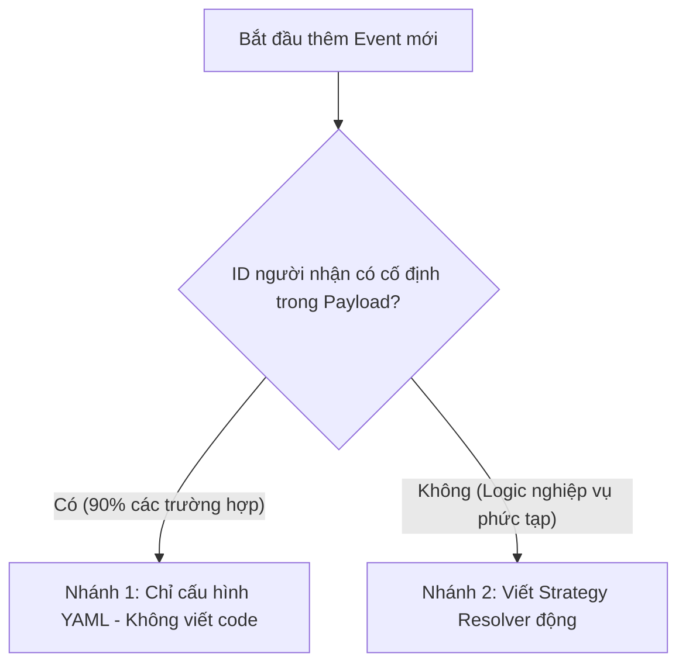

# 📘 Hướng Dẫn Thêm Mới & Bảo Trì Sự Kiện (Domain Events)

Tài liệu này hướng dẫn chi tiết quy trình cần thực hiện khi hệ thống có một **Domain Event mới** từ bất kỳ Microservice nào bắn ra, và muốn Notification Service tự động tiêu thụ, dịch nghĩa, định tuyến và gửi thông báo tới người dùng.

---

## ⚡ Tóm tắt luồng quyết định

Khi tiếp nhận một Event mới, hãy trả lời câu hỏi: **"ID người nhận thông báo có nằm cố định ở một trường cụ thể trong Payload của Event không?"**



---

## 🟢 Nhánh 1: Sự kiện thông thường (Chỉ cấu hình YAML - 0 dòng code)

Nếu người nhận được chỉ định trực tiếp qua một trường trong payload (ví dụ: `clientId`, `companionId`, `userId`, `accusedId`), bạn **không cần viết bất kỳ dòng code Java nào**.

### Các bước thực hiện:
1. Mở file cấu hình [templates.yaml](file:///e:/LEARN/rent-a-girlfriend/services/notification-service/config/templates.yaml).
2. Thêm cấu hình cho Event mới ở cuối file dưới dạng:

```yaml
  com.rentagf.[domain].[EventName].[Version]:
    type: "TRANSACTIONAL"              # Loại tin nhắn: TRANSACTIONAL | INTERACTION | PROMOTIONAL
    recipient_field: "trường_chứa_id"   # Tên field trong payload chứa ID người nhận (vd: userId)
    priority: "MEDIUM"                 # Độ ưu tiên: HIGH | MEDIUM | LOW
    channels: ["SSE", "FCM"]           # Các kênh muốn gửi: SSE, FCM, EMAIL
    template:
      vi:
        title: "Tiêu đề tiếng Việt 🎉"
        body: "Nội dung thông báo có chứa {{bienDong}}."
```

3. **Hoàn thành**. Khi Kafka bắn event này, hệ thống sẽ tự động dùng `SimpleRecipientResolver` để bốc tách ID người nhận và gửi tin.

---

## 🔴 Nhánh 2: Sự kiện phức tạp (Cần viết Strategy Resolver)

Nếu việc tìm người nhận cần có logic nghiệp vụ phức tạp (ví dụ: gửi cho cả 2 bên, hoặc gửi cho đối phương dựa trên vai trò của người thực hiện hành động), bạn cần viết thêm code Strategy.

### Các bước thực hiện:
1. **Cấu hình YAML**: Mở file [templates.yaml](file:///e:/LEARN/rent-a-girlfriend/services/notification-service/config/templates.yaml), thêm event và cấu hình `recipient_field` là `"_dynamic"` để báo hiệu cho Registry:

```yaml
  com.rentagf.booking.MyComplexEvent.v1:
    type: "TRANSACTIONAL"
    recipient_field: "_dynamic"        # Bắt buộc khai báo _dynamic
    priority: "HIGH"
    channels: ["SSE", "FCM"]
    template:
      vi:
        title: "Thông báo đặc biệt 🔔"
        body: "Nội dung..."
```

2. **Tạo Class Strategy**: Tạo mới một class đặt trong thư mục `internal/com/rentagf/notification/interfaces/event/resolver/` kế thừa interface `RecipientResolver`:

```java
package com.rentagf.notification.interfaces.event.resolver;

import com.fasterxml.jackson.databind.ObjectMapper;
import org.springframework.stereotype.Component;
import java.util.List;
import java.util.Map;
import java.util.UUID;

@Component
public class MyComplexEventResolver implements RecipientResolver {

    private final ObjectMapper objectMapper;

    // 1. Định nghĩa Local Record để parse schema an toàn (Compile-time safety)
    private record MyEventPayload(String actorRole, String clientId, String companionId) {}

    public MyComplexEventResolver(ObjectMapper objectMapper) {
        this.objectMapper = objectMapper;
    }

    @Override
    public List<UUID> resolve(Map<String, Object> eventData, String recipientField) {
        try {
            // 2. Ép kiểu Fail-Fast
            MyEventPayload payload = objectMapper.convertValue(eventData, MyEventPayload.class);
            
            // 3. Validate dữ liệu
            if (payload.clientId() == null || payload.companionId() == null) {
                throw new IllegalArgumentException("Payload missing required IDs");
            }

            // 4. Thực thi logic nghiệp vụ phức tạp để trả ra danh sách người nhận
            if ("CLIENT".equalsIgnoreCase(payload.actorRole())) {
                return List.of(UUID.fromString(payload.companionId()));
            }
            return List.of(UUID.fromString(payload.clientId()));
            
        } catch (Exception e) {
            throw new IllegalArgumentException("Invalid payload schema for MyComplexEvent", e);
        }
    }

    @Override
    public boolean supports(String eventType) {
        // 5. Khai báo khớp với Event Type
        return "com.rentagf.booking.MyComplexEvent.v1".equals(eventType);
    }
}
```

3. **Hoàn thành**. Spring Boot sẽ tự động nạp Strategy này vào `RecipientResolverRegistry` mà không cần bạn sửa bất kỳ dòng code nào ở Registry.

---

## 🚫 Quy tắc & Ranh giới (Do's & Don'ts)

### ĐƯỢC LÀM (Do's)
*   **LUÔN** khai báo `Private Local Record` bên trong class Resolver cụ thể để đạt được compile-time safety và tự động hóa việc deserialize bằng Jackson ObjectMapper.
*   **LUÔN** áp dụng **Fail-Fast**: Ném Exception lập tức nếu dữ liệu payload bị sai lệch cấu trúc (giúp hệ thống log chi tiết lỗi phát hiện bug sớm ở môi trường Dev/Staging).
*   **LUÔN** viết Unit Test cho Resolver mới tạo để đảm bảo logic rẽ nhánh chạy chính xác.

### KHÔNG ĐƯỢC LÀM (Don'ts)
*   **TUYỆT ĐỐI KHÔNG** tạo DTO dùng chung toàn cục (Global DTO) cho các event. Điều này vi phạm nguyên tắc Zero Cross-Service Dependency và làm tăng tính coupling giữa các Service.
*   **TUYỆT ĐỐI KHÔNG** chỉnh sửa code của class `RecipientResolverRegistry` hay `EventTranslator` khi thêm event mới (Tuân thủ triệt để nguyên lý Open-Closed: Mở rộng bằng cách thêm file mới, không sửa đổi code lõi cũ).
*   **TUYỆT ĐỐI KHÔNG** nuốt lỗi (silent catch). Mọi lỗi payload đều phải được ném ra ngoài để Consumer bắt và log chi tiết.
