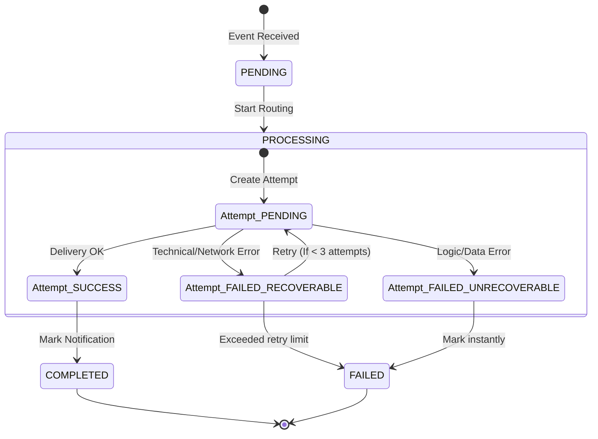

# 🔄 CỖ MÁY TRẠNG THÁI (STATE MACHINE)

Tài liệu này định nghĩa Vòng đời (Lifecycle) và cách chuyển đổi trạng thái (State Transitions) của các thực thể trong Notification Service. Việc tuân thủ nghiêm ngặt State Machine giúp code trở nên **clean**, dễ debug và ngăn chặn tuyệt đối các lỗi bất đồng bộ (như cố gắng gửi một thông báo đã bị hủy).

---

## 1. CÁC TRẠNG THÁI (STATES)

### 1.1. `Notification` States
Bảng `notifications` quản lý trạng thái tổng thể của một yêu cầu gửi tin.

| Trạng thái | Ý nghĩa |
| :--- | :--- |
| `PENDING` | Trạng thái khởi tạo. Worker vừa nhặt từ Message Queue và lưu vào DB. |
| `PROCESSING` | Đang trong quá trình định tuyến (Routing) hoặc đang đợi kết quả từ các bên thứ 3 (Firebase, SendGrid). |
| `COMPLETED` | (Terminal) Ít nhất một kênh đã gửi thành công tới User. Hoàn tất chu kỳ. |
| `FAILED` | (Terminal) Tất cả nỗ lực gửi đều thất bại (hết số lần Retry hoặc gặp lỗi không thể cứu vãn). |

### 1.2. `DeliveryAttempt` States
Bảng `delivery_attempts` quản lý trạng thái của từng *nỗ lực* gửi riêng biệt.

| Trạng thái | Ý nghĩa |
| :--- | :--- |
| `PENDING` | Nỗ lực đang được thực thi (Đẩy packet SSE hoặc gọi API Firebase). |
| `SUCCESS` | Lệnh gửi thành công (TCP socket ghi thành công hoặc HTTP 200 OK từ FCM). |
| `FAILED_RECOVERABLE` | Lệnh gửi thất bại nhưng có thể thử lại (ví dụ: TCP Timeout, 503 Service Unavailable). |
| `FAILED_UNRECOVERABLE` | Lệnh gửi thất bại vĩnh viễn, không thể thử lại (ví dụ: Token FCM không hợp lệ, Sai cú pháp). |

---

## 2. SƠ ĐỒ CHUYỂN ĐỔI (STATE TRANSITIONS)

---

## 3. CƠ CHẾ XỬ LÝ LỖI (FAILURE HANDLING)

Để bảo vệ tài nguyên hệ thống (tránh việc worker cứ ngốc nghếch Retry một lỗi không bao giờ sửa được), mọi lỗi trả về từ kênh gửi (FCM, Email, Socket) đều BẮT BUỘC phải phân loại thành 2 nhóm:

### 3.1. Recoverable Failures (Có thể thử lại)
Là các lỗi mang tính chất tạm thời, nguyên nhân từ hạ tầng hoặc mạng.
- **Ví dụ**: `503 Service Unavailable` từ Firebase, TCP Timeout, SSE `broken pipe` (User đi vào đường hầm mất sóng tạm thời).
- **Hành động (Transition)**:
  1. Chuyển `Attempt` thành `FAILED`.
  2. Kiểm tra số đếm Retry của `Notification`.
  3. Nếu `RetryCount < 3`: Backoff (chờ 1 khoảng thời gian) rồi tạo `Attempt` mới.
  4. Nếu `RetryCount == 3`: Chuyển `Notification` thành `FAILED`.

### 3.2. Unrecoverable Failures (Vô phương cứu chữa)
Là các lỗi thuộc về logic/dữ liệu sai, dù có Retry 100 lần kết quả vẫn vậy.
- **Ví dụ**: `400 Bad Request` (Sai format payload), FCM Token Invalid/NotRegistered (User đã gỡ App), Unsubscribed Email.
- **Hành động (Transition)**:
  1. Chuyển `Attempt` thành `FAILED`.
  2. **Bỏ qua giới hạn Retry**. Chuyển ngay lập tức `Notification` thành `FAILED`.
  3. (Tùy chọn tương lai): Bắn sự kiện ra Broker để Profile Service xóa Token rác đi.

---

## 4. VÍ DỤ MINH HỌA (EXAMPLES)

**Kịch bản**: User đang ở ngoài đường mạng chập chờn, FCM bị Timeout lần 1, nhưng thành công ở lần 2.

**Dòng thời gian Data trên DB:**

1. `T0`: Event đến. 
   - Notification `[ID: A]` được tạo -> State: `PENDING`.
2. `T1`: Bắt đầu gửi. 
   - Notification `[ID: A]` -> State: `PROCESSING`.
   - Tạo Attempt 1 `[ID: X]` -> Channel: `FCM`, State: `PENDING`.
3. `T2`: Hết timeout 5s, gọi Firebase báo lỗi.
   - Attempt 1 `[ID: X]` -> State: `FAILED`, Error: `"HTTP 504 Gateway Timeout"`. (Lỗi Recoverable).
4. `T3`: Delay 2s (Backoff). Tạo nỗ lực gửi thứ 2.
   - Tạo Attempt 2 `[ID: Y]` -> Channel: `FCM`, State: `PENDING`.
5. `T4`: Firebase trả về HTTP 200 OK.
   - Attempt 2 `[ID: Y]` -> State: `SUCCESS`.
   - Notification `[ID: A]` -> State: `COMPLETED`. Dừng toàn bộ.
