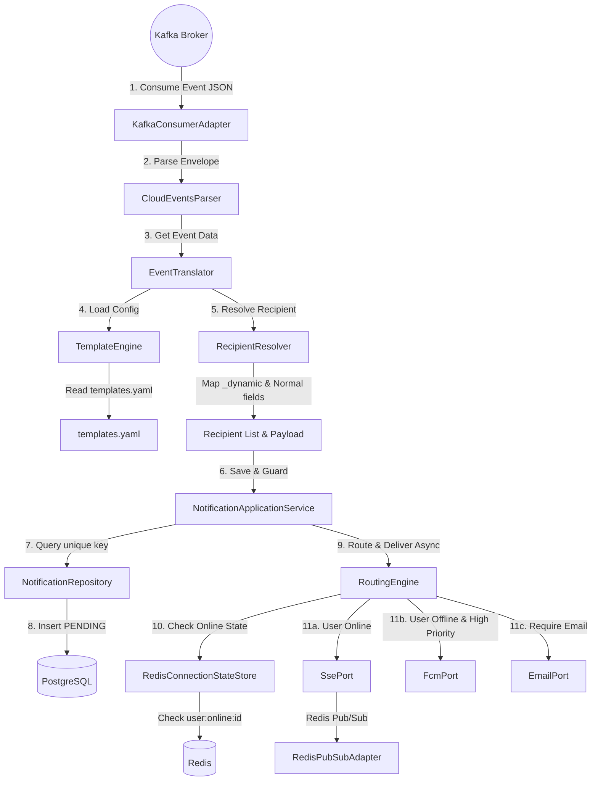

# 🛠️ SOLUTION DESIGN - PHASE 3: EVENT CONSUMER + ROUTING ENGINE

Tài liệu này chi tiết hóa thiết kế kỹ thuật, giải pháp kiến trúc và sơ đồ lớp cho các cấu phần của Phase 3. Thiết kế tuân thủ nghiêm ngặt **Kiến trúc Lục giác (Hexagonal Architecture)** và các ràng buộc nghiệp vụ của hệ thống **Rent-a-Girlfriend**.

---

## 1. Kiến trúc Tổng thể (Overall Architecture)

Sơ đồ dòng chảy dữ liệu (Data Flow Diagram) của hệ thống:



---

## 2. Giải pháp Kỹ thuật & Thiết kế Cực lõi (Core Solution Designs)

### 2.1. Đăng ký & Tiêu thụ Sự kiện (Kafka Consumer Adapter)
*   **Vị trí**: `infrastructure/adapter/inbound/KafkaEventConsumer.java`
*   **Chi tiết**:
    *   Sử dụng `@KafkaListener` lắng nghe trên các topics cấu hình qua `application.yml`.
    *   Hỗ trợ tiêu thụ bất đồng bộ, sử dụng cơ chế xử lý lỗi `DefaultErrorHandler` với `DeadLetterPublishingRecoverer` (DLQ) để tránh kẹt partition khi có event bị lỗi cấu trúc (poison pill).

### 2.2. Bộ lọc Trùng lặp (Idempotency Guard)
*   **Giải pháp**:
    *   Mỗi CloudEvent có thuộc tính `id` (UUID). Ta ánh xạ thuộc tính này làm `eventId` của thực thể `Notification`.
    *   Database đã được cấu hình chỉ mục UNIQUE `unique_event_user` cho cặp `(event_id, user_id)`.
    *   Trước khi lưu, `NotificationApplicationService` kiểm tra `notificationRepository.findByEventIdAndUserId(eventId, userId)`. Nếu tồn tại, ném `DuplicateEventException`.
    *   Ở lớp `KafkaEventConsumer`, ta bắt `DuplicateEventException`, ghi log `WARN`, thực hiện ACK tin nhắn với Kafka để bỏ qua an toàn và tiếp tục tiêu thụ tin nhắn tiếp theo.

### 2.3. Giải quyết Recipient Động (Dynamic Recipient Resolver)
*   **Vấn đề**: Các event như `BookingCancelled` có người nhận là đối phương của người thực hiện hành động (`actorRole`). Event `DisputeResolved` cần gửi cho **CẢ HAI BÊN** (Client và Companion).
*   **Giải pháp**:
    1.  Định nghĩa Interface `RecipientResolver`:
        ```java
        public interface RecipientResolver {
            List<UUID> resolve(Map<String, Object> eventData);
            boolean supports(String eventType);
        }
        ```
    2.  Triển khai các implementation cụ thể:
        *   `DefaultRecipientResolver`: Đọc trực tiếp trường cấu hình trong `templates.yaml` (ví dụ `clientId`, `companionId`, `userId`).
        *   `BookingCancelledRecipientResolver`: Đọc `actorRole`, `clientId` và `companionId`. Nếu `actorRole == CLIENT`, trả về `[companionId]`. N### 2.4. Công cụ Ráp Template & Interpolator (Template Engine)
*   **Giải pháp**:
    *   Sử dụng thư viện Jackson Dataformat YAML để parse `templates.yaml` thành cấu trúc Java Object `TemplateRegistry` khi khởi động ứng dụng.
    *   Placeholder Interpolator: Sử dụng Regular Expression `\{\{([a-zA-Z0-9_]+)\}\}` để tìm kiếm các placeholder. Sau đó, bóc tách giá trị tương ứng từ Event Payload (hỗ trợ camelCase) và thay thế.
    *   **Ngôn ngữ**: **Chỉ hỗ trợ ngôn ngữ tiếng Việt (`vi`)** được quy định trong template của `templates.yaml` ở Phase này. Bỏ qua hoàn toàn logic i18n để đảm bảo đơn giản tối đa.

### 2.5. Bài toán Trạng thái Kết nối Phân tán (Distributed Online State Store)
*   **Thách thức**: Notification Service chạy Cluster (nhiều Pods). User kết nối SSE ở Pod A, nhưng Kafka Event được consume ở Pod B. Làm sao Pod B biết User đang Online để gửi SSE First, tránh việc gửi nhầm FCM Push?
*   **Giải pháp thiết kế**: **Redis Connection State Store**
    1.  Khi Client bắt tay kết nối SSE thành công cục bộ trên một Pod:
        *   Lưu key `user:online:<userId>` vào Redis với TTL là **30 giây**. Giá trị lưu là ID của Pod hiện tại.
    2.  Pod duy trì kết nối phải gửi Heartbeat ping định kỳ mỗi **15 giây** (đã viết ở Phase 2). Mỗi lần ping thành công, Pod sẽ tự động refresh TTL của key `user:online:<userId>` thêm 30 giây nữa.
    3.  Khi Client ngắt kết nối chủ động hoặc do lỗi TCP, Pod thực hiện xóa key `user:online:<userId>` khỏi Redis.
    4.  Nếu Pod bị sập đột ngột (không kịp dọn dẹp): Key Redis tự động hết hạn sau 30 giây (TTL), đưa trạng thái User về Offline một cách an toàn.
    5.  Khi Routing Engine định tuyến: Gọi `redisTemplate.hasKey("user:online:" + userId)` để kiểm tra trạng thái Online của User tức thì (thao tác O(1) cực kỳ nhanh).

### 2.6. Tích hợp Outbound Adapters Thực tế (Email & FCM)
Để nâng cao giá trị thực tiễn và phục vụ học tập tốt nhất, Phase 3 KHÔNG sử dụng mock in-memory thuần túy mà sẽ tích hợp trực tiếp thư viện và SDK thực tế:
1.  **Email Outbound Adapter (`EmailOutboundAdapter.java`)**:
    *   Tận dụng thư viện `org.springframework.boot:spring-boot-starter-mail`.
    *   Sử dụng lớp `JavaMailSender` và `MimeMessageHelper` của Spring để tạo email dạng HTML phong phú.
    *   Cấu hình SMTP đến **Mailtrap Sandbox** cục bộ. Khi email được gửi đi, nó sẽ chui vào Mailtrap và bạn có thể mở Web UI để xem thư điện tử thật được render như thế nào.
2.  **FCM Outbound Adapter (`FcmOutboundAdapter.java`)**:
    *   Sử dụng thư viện SDK chính thức `com.google.firebase:firebase-admin` (sẽ được thêm vào `build.gradle` ở Phase 3 này).
    *   Khi ứng dụng startup, adapter sẽ thử tải file Service Account credentials (file JSON của Firebase Console) từ root dự án.
    *   Nếu tìm thấy file cấu hình: Initialize `FirebaseApp` và sử dụng `FirebaseMessaging.getInstance().sendAsync()` để đẩy tin thật sang Firebase Cloud Messaging.
    *   Nếu không tìm thấy file cấu hình (ở môi trường DEV chưa có credentials): Adapter sẽ tự động fallback sang chế độ **Simulated Mode**, ghi nhận đầy đủ hành vi gửi tin, tạo độ trễ mạng giả lập bằng Virtual Threads và ghi log chi tiết JSON payload gửi sang Firebase để phục vụ việc debug.

---

## 3. Phân tích Đánh đổi Kiến trúc (Architectural Trade-offs)

| Tiêu chí | Phương án A: Redis Connection State (Được chọn) | Phương án B: Fire-and-Forget + ACK Fallback |
| :--- | :--- | :--- |
| **Mô tả** | Ghi nhận trạng thái kết nối lên Redis. Routing Engine check trước khi gửi. | Luôn gửi SSE qua Redis Pub/Sub, chờ Client ACK. Nếu không có ACK sau trễ thì gửi FCM. |
| **Độ trễ khi Fallback** | **Cực thấp (Realtime)**. Phát hiện offline và gửi FCM ngay lập tức. | **Cao**. Phải chờ timeout ACK (thường 2s-3s) mới kích hoạt gửi FCM. |
| **Độ phức tạp Client** | **Thấp**. Client chỉ cần duy trì nhận SSE như bình thường. | **Cao**. Client phải viết logic gửi HTTP POST/WebSocket ACK ngược lại Server khi nhận tin. |
| **Độ phức tạp Server** | **Trung bình**. Thêm logic duy trì Redis key và refresh TTL ở lớp SSE. | **Rất cao**. Phải quản lý state gửi tin, đặt timer và lắng nghe ACK từ Client. |
| **Tải lên hệ thống** | Tăng nhẹ tải ghi/refresh lên Redis (vẫn nằm trong khả năng đáp ứng cực tốt của Redis RAM). | Tăng tải HTTP Request (do client gửi ACK liên tục) và tải quản lý Thread/Timer trên Server. |

---

## 4. Thiết kế các Lớp & Package mới (Class & Package Layout)

Tuân thủ nghiêm ngặt ranh giới kiến trúc Lục giác để vượt qua bộ kiểm thử ArchUnit (không có đa ngôn ngữ/i18n):

```text
com.rentagf.notification
│
├── domain/                         <-- Pure Java (Không chứa Spring, JPA, Web imports)
│   └── errors/
│       └── DuplicateEventException.java
│
├── application/                    <-- Lõi logic ứng dụng
│   ├── port/
│   │   ├── inbound/
│   │   │   └── SendNotificationUseCase.java  [NEW] (Interface Inbound Port)
│   │   └── outbound/
│   │       └── ConnectionStatePort.java     [NEW] (Kiểm tra online state)
│   │
│   ├── service/
│   │   ├── NotificationApplicationService.java (Điều phối lưu DB + gửi async)
│   │   └── SendNotificationService.java      [NEW] (Triển khai SendNotificationUseCase)
│   │
│   └── registry/
│       └── NotificationSenderRegistry.java
│
├── interfaces/                     <-- Điểm tiếp nhận request/event
│   └── event/                      [NEW]
│       ├── KafkaEventConsumer.java [NEW] (Kafka Inbound Adapter)
│       ├── CloudEventsParser.java  [NEW] (Giải mã CloudEvent Envelope)
│       └── EventTranslator.java    [NEW] (Dịch sự kiện dựa trên templates.yaml)
│
└── infrastructure/                 <-- Triển khai các Port Outbound & Công nghệ
    ├── adapter/
    │   └── RedisConnectionStateAdapter.java [NEW] (Lưu/đọc trạng thái online trên Redis)
    │
    └── config/
        ├── KafkaConfig.java        [NEW] (Cấu hình Spring Kafka)
        └── TemplateConfig.java     [NEW] (Load templates.yaml và cấu hình template engine)
```

