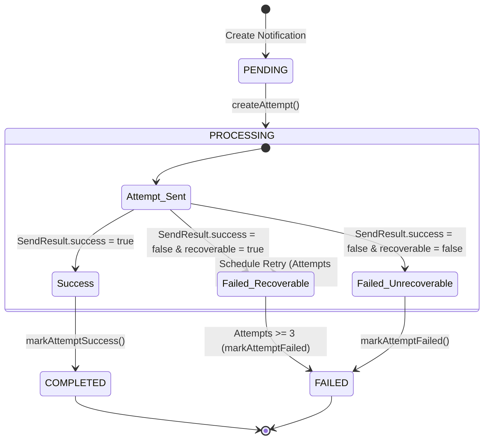
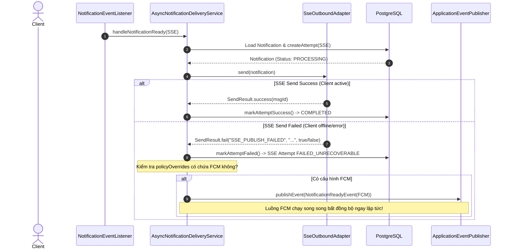

# 📑 PRODUCT REQUIREMENTS DOCUMENT (PRD) - PHASE 5: OUTBOUND PROVIDERS & RETRY EXECUTION

## 1. Tổng quan kỹ thuật

Tài liệu này định nghĩa chi tiết kiến trúc kỹ thuật và đặc tả triển khai cho **Phase 5: Outbound Providers (FCM Push & Email) + Retry Execution** trong dịch vụ **Notification Service**. 

Hệ thống được thiết kế theo mô hình **Hexagonal Architecture (Kiến trúc Lục giác)**, lập trình bất đồng bộ hiệu năng cao tận dụng tối đa **Java 21 Virtual Threads (SimpleAsyncTaskExecutor)** và đồng bộ phân tán qua **Redis Connection State & Pub/Sub**.

---

## 🎯 Ranh giới Dự án (Project Boundaries)

### 1. Phạm vi thực hiện (In-scope)
* **Outbound Adapters**:
  - **`FcmOutboundAdapter`**: Hoàn thiện tích hợp Firebase Admin SDK thực tế sử dụng Service Account Credentials sẵn có (`notification-service-d166c-firebase-adminsdk-fbsvc-4b6bc988c1.json`) để gửi Push Notification qua Topic của User (`user-<userId>`). Vẫn hỗ trợ chế độ mô phỏng (**Simulation Mode**) làm fallback để tránh crash khi chạy local/test thiếu credentials.
  - **`EmailOutboundAdapter`**: Hoàn thiện gửi email thật qua giao thức SMTP sử dụng **Mailtrap SMTP Sandbox** (gói miễn phí cực kỳ tối ưu cho testing & demo) bằng cách tích hợp `JavaMailSender` của Spring Boot Starter Mail. Cấu hình được nạp từ `.env`.
* **Non-blocking Delayed Retry Engine**:
  - Thiết lập Port **`RetrySchedulerPort`** và Adapter mặc định **`InMemoryRetryScheduler`** sử dụng **`ScheduledExecutorService`** của Java để lên lịch retry trì hoãn.
  - Áp dụng chính sách **Exponential Backoff** cho từng kênh:
    - **FCM**: 2s -> 4s -> 8s.
    - **Email**: 5s -> 15s -> 45s.
* **Cơ chế Phân loại lỗi (Error Classification)**:
  - Phân tích kết quả gửi `SendResult` để tách biệt lỗi **Recoverable** (kích hoạt retry) và **Unrecoverable** (dừng retry ngay lập tức, chuyển trạng thái FAILED).
* **SSE to FCM Fallback**:
  - Tự động chuyển kênh sang FCM Push bất đồng bộ khi nỗ lực gửi SSE thực tế bị thất bại hoặc client offline đột ngột.
* **Quản lý Transaction & Tối ưu hóa Database Connection (Hikari Exhaustion Guard)**:
  - Tách biệt hoàn toàn Database Transaction ra khỏi các cuộc gọi mạng ngoại vi (FCM API, SMTP Server).
  - Sử dụng các transaction siêu ngắn để đọc/ghi DB ở đầu và cuối luồng. Cuộc gọi mạng I/O được thực thi độc lập (ngoài transaction) để tránh tình trạng Virtual Threads giữ connection DB quá lâu dẫn đến sập Connection Pool.

### 2. Nằm ngoài phạm vi (Out-of-scope)
* Cơ chế Persistent Retry bằng Kafka Delayed Topics hoặc RabbitMQ Delayed Exchange (sẽ cấu trúc sẵn Port để cắm vào ở Phase sau).
* Quản lý vòng đời token thiết bị của người dùng (thuộc trách nhiệm của Profile/Auth Service).

---

## 2. Kiến trúc Hexagonal & Phân chia Trách nhiệm (Single Responsibility)

Chúng ta tuân thủ nghiêm ngặt ranh giới giữa các Layer trong kiến trúc Hexagonal để đảm bảo tính chịu lỗi, cô lập lỗi và khả năng dễ thay đổi (**Change Propagation**):

```mermaid
graph TD
    subgraph Interfaces [Interfaces Layer - Event Listeners]
        listener[NotificationEventListener]
    end

    subgraph Application [Application Layer - Business Workflows]
        in_port[AsyncNotificationDeliveryService]
        
        retry_port[RetrySchedulerPort]
        fcm_port[FcmPort]
        email_port[EmailPort]
        sse_port[SsePort]
    end

    subgraph Domain [Domain Layer - Pure Business Logic]
        agg[Notification Aggregate Root]
        attempt[DeliveryAttempt Entity]
        result[SendResult VO]
        repo_port[NotificationRepository Port]
    end

    subgraph Infrastructure [Infrastructure Layer - Adapters]
        db_adapter[NotificationRepositoryImpl]
        fcm_adapter[FcmOutboundAdapter]
        email_adapter[EmailOutboundAdapter]
        sse_adapter[SseOutboundAdapter]
        scheduler_adapter[InMemoryRetryScheduler]
    end

    %% Giao tiếp
    listener --> in_port
    in_port --> fcm_port
    in_port --> email_port
    in_port --> sse_port
    in_port --> retry_port
    in_port --> repo_port

    fcm_adapter ..|> fcm_port
    email_adapter ..|> email_port
    sse_adapter ..|> sse_port
    scheduler_adapter ..|> retry_port
    db_adapter ..|> repo_port
```

### 2.1. Thiết kế cho sự thay đổi (Change Propagation Mindset)
Để đảm bảo sau này có thể dễ dàng thay đổi cơ chế Retry từ **In-Memory** sang **Distributed Message Broker (Kafka/RabbitMQ)** mà không cần sửa đổi bất kỳ dòng code nào ở tầng Application/Domain, chúng ta trừu tượng hóa cơ chế lên lịch retry qua interface **`RetrySchedulerPort`**:

```java
package com.rentagf.notification.application.port.outbound;

import com.rentagf.notification.domain.vo.enums.DeliveryChannel;
import java.time.Duration;
import java.util.UUID;

public interface RetrySchedulerPort {
    /**
     * Lên lịch gửi lại thông báo bất đồng bộ sau một khoảng thời gian trễ.
     *
     * @param notificationId ID của thông báo cần retry
     * @param channel        Kênh gửi tin tương ứng
     * @param delay          Khoảng thời gian trì hoãn (Backoff)
     */
    void scheduleRetry(UUID notificationId, DeliveryChannel channel, Duration delay);
}
```

---

## 3. Thiết kế Retry Engine & Chính sách Backoff ([INV-N10])

### 3.1. Sơ đồ Trạng thái Notification & Quy trình Thử lại (State Machine Flow)



### 3.2. Cấu trúc Tính toán Backoff Delay
Hàm tính toán thời gian trễ sẽ được đặt tại `AsyncNotificationDeliveryService` dựa trên số lượng attempt đã thất bại trong quá khứ của `Notification` Aggregate:

$$\text{FCM Delay} = \begin{cases} 2\text{s} & \text{lần thất bại thứ } 1 \\ 4\text{s} & \text{lần thất bại thứ } 2 \\ 8\text{s} & \text{lần thất bại thứ } 3 \end{cases}$$

$$\text{Email Delay} = \begin{cases} 5\text{s} & \text{lần thất bại thứ } 1 \\ 15\text{s} & \text{lần thất bại thứ } 2 \\ 45\text{s} & \text{lần thất bại thứ } 3 \end{cases}$$

### 3.3. InMemoryRetryScheduler Implementation Details
Sử dụng `ScheduledExecutorService` kết hợp với Java Virtual Threads để thực thi task trì hoãn cực kỳ gọn nhẹ:

```java
@Slf4j
@Component
public class InMemoryRetryScheduler implements RetrySchedulerPort {

    private final ScheduledExecutorService scheduler = Executors.newSingleThreadScheduledExecutor(
            r -> {
                Thread t = new Thread(r, "retry-scheduler");
                t.setDaemon(true);
                return t;
            }
    );
    
    private final ApplicationEventPublisher eventPublisher;

    public InMemoryRetryScheduler(ApplicationEventPublisher eventPublisher) {
        this.eventPublisher = eventPublisher;
    }

    @Override
    public void scheduleRetry(UUID notificationId, DeliveryChannel channel, Duration delay) {
        log.info("Scheduling retry for notification {} via channel {} after {}s", notificationId, channel, delay.toSeconds());
        
        scheduler.schedule(() -> {
            log.info("Retry timer fired for notification {}. Dispatching event.", notificationId);
            // Bắn lại sự kiện NotificationReadyEvent bất đồng bộ để kích hoạt gửi lại
            eventPublisher.publishEvent(new NotificationReadyEvent(notificationId, channel));
        }, delay.toMillis(), TimeUnit.MILLISECONDS);
    }
}
```

---

## 4. Đặc tả Cơ chế Fallback SSE -> FCM Push ([INV-N09])

Khi hệ thống phát hiện người dùng online, nó sẽ ưu tiên định tuyến qua SSE. Tuy nhiên, nếu luồng gửi SSE thực tế bị thất bại (do Redis Pub/Sub lỗi, socket ngắt kết nối đột ngột), hệ thống phải tự động kích hoạt gửi kênh FCM thay thế.

### Sequence Diagram chi tiết của luồng Fallback:



---

## 5. Đặc tả Kỹ thuật Outbound Adapters (FCM & SMTP)

### 5.1. FcmOutboundAdapter
- **Simulation Mode**: 
  - Nếu file `notification-service-d166c-firebase-adminsdk-fbsvc-4b6bc988c1.json` không tồn tại trong classpath hoặc thư mục cấu hình, Firebase SDK sẽ không thể khởi tạo.
  - Adapter phải tự động chuyển sang chế độ giả lập (Simulation Mode), ghi log cảnh báo rõ ràng `[FCM SIMULATION MODE]` và trả về `SendResult.success("sim-" + UUID.randomUUID())` để phục vụ phát triển cục bộ và kiểm thử khi thiếu credentials.
- **Real Mode**:
  - Gửi qua Firebase Messaging SDK chính thức sử dụng Service Account Credentials sẵn có (`notification-service-d166c-firebase-adminsdk-fbsvc-4b6bc988c1.json`) tới topic `user-<userId>` để đảm bảo tự động phân phối đến toàn bộ thiết bị đã đăng ký của user đó.
- **Phân loại lỗi**:
  - `recoverable = true`: Lỗi mạng, timeout, hoặc HTTP 429 Too Many Requests từ Firebase.
  - `recoverable = false`: Lỗi cấu hình sai xác thực, Token sai cấu trúc hoặc Topic không tồn tại.

### 5.2. EmailOutboundAdapter
- Sử dụng `JavaMailSender` của Spring để giao tiếp với SMTP Server.
- Cấu hình Mailtrap SMTP Sandbox (gói miễn phí cực kỳ tối ưu và an toàn để demo & testing) thông qua các biến môi trường trong file `.env`:
  ```properties
  spring.mail.host=sandbox.smtp.mailtrap.io
  spring.mail.port=2525
  spring.mail.username=${MAILTRAP_USERNAME}
  spring.mail.password=${MAILTRAP_PASSWORD}
  spring.mail.properties.mail.smtp.auth=true
  spring.mail.properties.mail.smtp.starttls.enable=true
  ```
- **Phân loại lỗi**:
  - `recoverable = true`: Lỗi `MailSendException` do kết nối mạng tới SMTP Server bị nghẽn hoặc timeout.
  - `recoverable = false`: Lỗi `MailParseException` (sai cấu trúc email, email người nhận không tồn tại hoặc sai định dạng).

---

## 6. Chính sách Log, Debug & Xử lý sự cố production

Để đảm bảo hệ thống có khả năng quan sát (Observability) cao nhất trên Production, tất cả các bước gửi tin, lập lịch retry, và lỗi phát sinh đều phải được log kèm ngữ cảnh phong phú (MDC):
1. **Log Format**: `[NotificationID] [Channel] [AttemptNumber] [Action] [Status] - Detail message`
   - Ví dụ: `[e48d3c12] [FCM] [Attempt #2] - Sending push to user user-3211...`
   - Ví dụ: `[e48d3c12] [FCM] [Attempt #2] - Failed. Error: FCM_UNAVAILABLE. Scheduling retry in 4s...`
2. **Database State Audit**: Mọi attempt đều phải được lưu trữ trong bảng `delivery_attempts` với đầy đủ `resolved_at`, `error_code`, `error_message` để làm cơ sở đối soát và xử lý khiếu nại.
